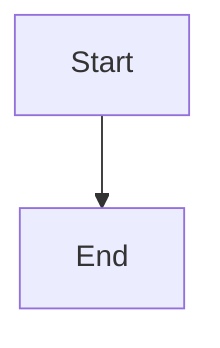

# Contributing to RAE Documentation

**Welcome!** This guide explains how to add, update, and maintain RAE documentation.

## 📁 Documentation Structure

```
docs/
├── .auto-generated/      # ⚠️ DO NOT EDIT - Auto-updated by CI/CD
├── guides/               # User-facing tutorials and how-tos
├── reference/            # Technical specifications and APIs
├── compliance/           # ISO 42001, GDPR, regulatory docs
├── project-design/       # Design decisions and planning
└── operations/           # Runbooks and operational guides
```

## 🤖 Auto-Generated vs Manual

### Auto-Generated Files (DO NOT EDIT)

Located in `docs/.auto-generated/`:
- **status/STATUS.md** - Project metrics (coverage, tests, commit)
- **status/TESTING_STATUS.md** - Test results and coverage
- **reports/CHANGELOG.md** - Git commit history
- **reports/TODO.md** - Extracted TODOs from code
- **api/openapi.json** - OpenAPI specification (planned)
- **metrics/complexity.md** - Code complexity (planned)

**These are regenerated on every commit!** Manual edits will be lost.

### Manual Files (You Can Edit)

All other files in `docs/`:
- Guides, tutorials, explanations
- Architecture documentation
- Compliance policies
- Design decisions

## ✍️ Adding New Documentation

### Step 1: Choose the Right Location

Ask yourself:
- **Is this a guide/tutorial?** → `docs/guides/`
- **Is this technical reference?** → `docs/reference/`
- **Is this about compliance?** → `docs/compliance/`
- **Is this about a feature design?** → `docs/project-design/active/`
- **Is this operational?** → `docs/operations/`

### Step 2: Use a Template

Templates available in `docs/templates/` (see below for template creation).

**Example: Adding a new guide**

```bash
# Copy template
cp docs/templates/guide-template.md docs/guides/my-new-guide.md

# Edit with your content
$EDITOR docs/guides/my-new-guide.md

# Add to index
# Edit docs/guides/README.md and add link
```

### Step 3: Follow the Style Guide

#### Formatting
- **Headers:** Use `#` for title, `##` for sections, `###` for subsections
- **Code blocks:** Always specify language: ` ```python ` not ` ``` `
- **Links:** Use relative paths: `[Link](../reference/api.md)` not absolute URLs
- **Images:** Store in `docs/assets/images/`, reference as ``

#### Content
- **First paragraph:** Should be a clear summary (used in search)
- **Prerequisites:** List what user needs to know before reading
- **Examples:** Always include working code examples
- **Related docs:** Link to related documentation at bottom
- **Last updated:** Add footer: `**Last Updated:** YYYY-MM-DD`

#### Language
- **English only** for all docs (except JST-specific Polish content)
- Use active voice: "Run the command" not "The command should be run"
- Use present tense: "The API returns" not "The API will return"
- Be concise: Shorter is better

### Step 4: Add Links

1. **Add to parent INDEX.md or README.md**
   ```markdown
   - [My New Guide](my-new-guide.md) - Brief description
   ```

2. **Add to main documentation navigation** (if major feature)
   Edit `README.md` in repository root.

3. **Cross-link from related docs**
   Find related documentation and add links bidirectionally.

### Step 5: Validate

```bash
# Check for broken links (optional tool - to be added)
make docs-validate

# Preview locally (if using mkdocs or similar)
make docs-serve

# Check file appears in inventory
git add docs/guides/my-new-guide.md
python scripts/docs_automator.py  # Will update DOCUMENTATION_INVENTORY
```

## 🔄 Updating Existing Documentation

### Before Editing

1. **Check if auto-generated:** If in `docs/.auto-generated/`, stop! File is generated by CI.
2. **Check last modified date:** Look at git history: `git log -1 --format="%ai" -- path/to/file.md`
3. **Read the current content:** Understand the structure before making changes

### Making Changes

1. **Small fixes (typos, clarity):** Just edit and commit
2. **Major rewrites:** Consider creating a new version and deprecating old
3. **Changing structure:** Update all cross-links

### After Editing

1. **Update "Last Updated" footer:** Change date to today
2. **Check broken links:** Ensure all `[text](link.md)` still work
3. **Commit with clear message:** `docs: update XYZ guide with ABC examples`

## 🎯 Documentation Types

### 1. Tutorials (Step-by-Step)

**Location:** `docs/guides/`

**Format:**
```markdown
# Tutorial: Doing XYZ

Learn how to accomplish XYZ in 10 minutes.

## Prerequisites
- Basic Python knowledge
- RAE installed

## Step 1: Setup
...

## Step 2: Implementation
...

## Next Steps
- [Related Tutorial](link.md)
```

### 2. How-To Guides (Problem-Solving)

**Location:** `docs/guides/`

**Format:**
```markdown
# How to Solve Problem X

Quick guide to fix/implement X.

## Problem
Description of what user wants to do.

## Solution
Step-by-step solution.

## Why This Works
Explanation of underlying concept.

## Troubleshooting
Common issues and fixes.
```

### 3. Reference (Technical Specs)

**Location:** `docs/reference/`

**Format:**
```markdown
# API Reference: Module Name

Complete reference for ModuleName API.

## Classes

### ClassName
Description of class.

**Methods:**
- `method_name(param: type) -> return_type`: Description

**Example:**
\`\`\`python
example code
\`\`\`

## Functions

### function_name
...
```

### 4. Explanation (Concepts)

**Location:** `docs/reference/concepts/` or `docs/guides/`

**Format:**
```markdown
# Understanding Concept X

Deep dive into how X works in RAE.

## What Is It?
High-level explanation.

## How It Works
Technical details.

## When to Use It
Use cases and examples.

## Related Concepts
Links to related docs.
```

## 🌍 Internationalization (Polish for JST)

JST (Jednostki Samorządu Terytorialnego) documentation can include Polish translations:

### Structure
```
docs/guides/jst/
├── README.md          # Polish language index
├── deployment.md      # Polish content
└── compliance.md      # Polish content (RODO, etc.)
```

### Guidelines
- **File name:** English (e.g., `deployment.md`)
- **Content:** Polish language
- **Technical terms:** Keep English (e.g., "API", "Docker", "Kubernetes")
- **Headers:** Can be Polish
- **Code examples:** English (code is universal)

## 🔧 Auto-Documentation

### Adding New Auto-Generated Content

Want to auto-generate a new file? Follow these steps:

#### 1. Create Generator Function

Add to `scripts/docs_generators/your_generator.py`:

```python
def generate_your_doc():
    """Generate your documentation."""
    # Your logic here
    content = "# Generated Doc\n\n"
    content += "Auto-generated content...\n"

    output_path = "docs/.auto-generated/your-category/your-doc.md"
    os.makedirs(os.path.dirname(output_path), exist_ok=True)

    with open(output_path, "w") as f:
        f.write(content)

    print(f"✅ Generated {output_path}")
```

#### 2. Add to Main Automator

Edit `scripts/docs_automator.py`:

```python
from docs_generators.your_generator import generate_your_doc

def main():
    # ... existing generators ...
    generate_your_doc()  # Add your generator
```

#### 3. Update Workflow

Edit `.github/workflows/docs.yml`:

```yaml
- name: Commit and Push changes
  with:
    file_pattern: 'CHANGELOG.md STATUS.md TODO.md docs/.auto-generated/your-category/your-doc.md'
```

#### 4. Test Locally

```bash
python scripts/docs_automator.py
git status  # Should show your new file
```

#### 5. Document It

Update `docs/.auto-generated/README.md` with your new file.

## 🧪 Testing Documentation

### Link Validation

```bash
# Install link checker (future)
pip install linkchecker

# Check docs
linkchecker docs/
```

### Preview Changes

```bash
# Serve docs locally (if using mkdocs)
mkdocs serve

# View at http://localhost:8000
```

### Spell Check

```bash
# Install aspell
sudo apt-get install aspell

# Check spelling
find docs -name "*.md" -exec aspell check {} \;
```

## 📊 Documentation Metrics

We track:
- **Coverage:** % of code with documentation
- **Freshness:** Age of documentation files
- **Broken links:** Number of 404s
- **TODOs:** Documentation tasks in code

View metrics in `docs/.auto-generated/metrics/docs-health.md` (planned).

## ❓ FAQ

### Can I edit README.md in the repo root?
**Yes!** The main README.md is manually maintained. Edit freely.

### Can I edit CHANGELOG.md?
**Partially.** The "Recent Changes" section is auto-generated. Add manual sections elsewhere.

### Can I delete old documentation?
**Carefully.** Check for broken links first. Consider moving to `docs/archive/` instead.

### How do I add images?
Store in `docs/assets/images/`, reference with relative path: ``

### How do I add diagrams?
Use Mermaid syntax (rendered by GitHub):
````markdown

````

### Where do I document new APIs?
1. Add docstrings to Python code
2. OpenAPI spec will auto-generate from FastAPI
3. Add high-level guide to `docs/guides/developers/`

## 🔗 Related Resources

- [Documentation Plan](docs/project-design/active/DOCUMENTATION_AUTOMATION_PLAN.md)
- [Documentation Inventory](docs/project-design/active/DOCUMENTATION_INVENTORY.md)
- [Main README](../README.md)
- [Contributing Guide](../CONTRIBUTING.md)

## 🆘 Getting Help

- **Questions?** Open a GitHub issue with label `documentation`
- **Found a typo?** Just fix it and submit a PR
- **Major changes?** Discuss in an issue first

---

**Last Updated:** 2025-12-06
**Maintained by:** RAE Documentation Team
