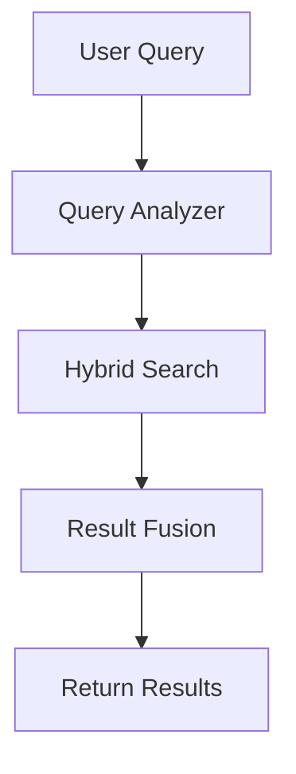

# RAE Documentation Style Guide

> **Unified Documentation Standards** - Write documentation that's clear, consistent, and professional.

---

## Overview

This guide ensures all RAE documentation maintains consistent style, structure, and quality. Follow these rules when creating or updating any documentation.

**Target Audience**:
- 🔬 Academic researchers
- 🏢 Enterprise developers
- 💻 Open-source contributors
- 📊 Technical reviewers
- 🤖 AI agents (Claude Code, etc.)

---

## Document Structure

### 1. Standard Template

Every major documentation file should follow this structure:

```markdown
# Title - Clear, Descriptive

> **One-line summary** - What this document covers.

---

## Overview

High-level introduction (2-3 paragraphs)
- What is this about?
- Why does it matter?
- Who is this for?

---

## [Main Sections]

Detailed content organized by topic...

---

## Related Documentation

- [Link](path) - Description
- [Link](path) - Description

---

**Version**: X.Y.Z
**Last Updated**: YYYY-MM-DD
**Status**: Production Ready / Beta / Experimental
```

### 2. Section Hierarchy

```
# H1 - Document Title (only one per file)
## H2 - Major Sections
### H3 - Subsections
#### H4 - Details (rare, avoid if possible)
```

**Rule**: Never skip heading levels (no H1 → H3 without H2).

---

## Writing Style

### Voice & Tone

✅ **DO**:
- Use clear, direct language
- Write in active voice: "RAE uses hybrid search" (not "Hybrid search is used by RAE")
- Be concise: prefer short sentences
- Use technical terms correctly and consistently

❌ **DON'T**:
- Use marketing fluff or hype
- Write unnecessarily complex sentences
- Use slang or informal language
- Over-use emojis (1-2 per section max)

### Examples

**Good**:
```markdown
RAE implements a 4-layer memory architecture inspired by human cognition. Each layer serves a distinct function, from immediate sensory input to high-level meta-learning.
```

**Bad**:
```markdown
🚀 RAE is an AMAZING system that uses a super cool 4-layer thingy that's kinda like how humans think! 🧠💡
```

---

## Formatting Standards

### 1. Code Blocks

Always specify language for syntax highlighting:

````markdown
```python
def create_memory(content: str) -> Memory:
    return Memory(content=content)
```
````

Supported languages: `python`, `bash`, `yaml`, `json`, `sql`, `markdown`

### 2. File Paths

Use inline code for file paths:

```markdown
See [`apps/memory_api/services/hybrid_search_service.py`](../../apps/memory_api/services/hybrid_search_service.py)
```

**Rule**: Always use relative paths, never absolute.

### 3. Commands

Use bash code blocks for command-line examples:

```markdown
```bash
# Run tests
pytest apps/memory_api/tests/
```
```

### 4. Links

**Internal links** (within RAE docs):
```markdown
See [Memory Layers](./MEMORY_LAYERS.md) for details.
See [Math Layers](../architecture/MATH_LAYERS.md) from api/ folder.
```

**External links**:
```markdown
See [FastAPI documentation](https://fastapi.tiangolo.com/) for details.
```

**Rule**: Describe what the link points to, never "click here".

### 5. Tables

Use tables for structured comparisons:

```markdown
| Feature | RAE | Competitor |
|---------|-----|------------|
| Multi-layer memory | ✅ Yes | ❌ No |
| GraphRAG | ✅ Yes | ⚠️ Limited |
```

**Alignment**: Left-align text, right-align numbers.

### 6. Lists

**Unordered lists**:
```markdown
- First item
- Second item
  - Nested item
```

**Ordered lists**:
```markdown
1. First step
2. Second step
   1. Sub-step
```

**Rule**: Use ordered lists for steps, unordered for features/options.

---

## Technical Terminology

### Consistent Terms

Use these exact terms consistently:

| Correct ✅ | Incorrect ❌ |
|-----------|-------------|
| **Memory Layers** | Memory levels, memory tiers |
| **Math Layers** | Mathematical layers, math tiers |
| **Hybrid Search** | Multi-search, composite search |
| **GraphRAG** | Graph RAG, graph-rag |
| **LLM Orchestrator** | LLM manager, model orchestrator |
| **Reflection Engine** | Reflection system, reflector |
| **Context Builder** | Context assembler, context maker |
| **Tenant** | Organization, account |
| **Project** | Workspace, namespace |

### Layer Names

| Database Value | Display Name | Usage |
|----------------|--------------|-------|
| `stm` | Short-Term Memory (STM) or Layer 1 | Code/technical |
| `ltm` | Long-Term Memory (LTM) or Layer 3 | Code/technical |
| `em` | Episodic Memory (EM) or Layer 2/3 | Code/technical |
| `rm` | Reflective Memory (RM) or Layer 4 | Code/technical |

**Rule**: Use "Layer N" in user-facing docs, database codes in technical docs.

---

## Code Examples

### Python Style

Follow PEP 8 + RAE conventions:

```python
# ✅ GOOD
from apps.memory_api.services.hybrid_search_service import HybridSearchService

async def search_memories(query: str) -> list[Memory]:
    """Search memories using hybrid search.

    Args:
        query: Search query string

    Returns:
        List of matching memories
    """
    service = HybridSearchService()
    return await service.search(query=query, top_k=10)
```

**Rules**:
- Always include docstrings (Google style)
- Type hints required for function signatures
- Use async/await consistently
- Imports at top, grouped (stdlib → third-party → local)

### Bash Style

```bash
# ✅ GOOD
# Initialize database (first time only)
./scripts/init-database.sh

# Start all services
docker-compose up -d

# Check health
curl http://localhost:8000/health
```

**Rules**:
- Add comments for non-obvious commands
- Use long-form flags when possible (`--help` not `-h`)
- One command per line (exception: chained with `&&`)

---

## Diagrams

### ASCII Diagrams

Use box-drawing characters for architecture diagrams:

```
┌────────────────────────────────────┐
│         RAE CORE ENGINE            │
│   4-Layer Memory + Math + GraphRAG │
└──────────────┬─────────────────────┘
               │
               ↓
┌──────────────┴─────────────────────┐
│      LLM ORCHESTRATOR              │
└──────────────┬─────────────────────┘
               │
     ┌─────────┼─────────┐
     ↓         ↓         ↓
  OpenAI   Claude    Ollama
```

**Tools**: Use https://asciiflow.com/ for complex diagrams.

### Mermaid Diagrams (Optional)

For complex flows, use Mermaid:

````markdown

````

**Rule**: Keep diagrams simple. If > 10 nodes, split into multiple diagrams.

---

## Icons & Symbols

### Approved Icons

Use sparingly (max 1-2 per section):

| Icon | Meaning | Usage |
|------|---------|-------|
| ✅ | Success, Complete, Correct | Status indicators |
| ❌ | Failure, Incomplete, Incorrect | Status indicators |
| ⚠️ | Warning, Caution | Important notices |
| 🔴 | Critical, Blocker | Critical issues |
| 🟡 | In Progress, Beta | Development status |
| 🟢 | Ready, Stable | Production status |
| 📊 | Metrics, Analytics | Data/metrics sections |
| 🔒 | Security, Privacy | Security features |
| 🧠 | Memory, Cognitive | Memory system |
| 🔢 | Math, Algorithms | Mathematical layers |
| 🔍 | Search, Discovery | Search features |
| 🎭 | LLM, Orchestration | LLM features |

**Rule**: No other emojis. Keep it professional.

### Status Badges

```markdown
**Status**: ✅ Production Ready
**Status**: 🟡 Beta
**Status**: ⏳ Planned
**Status**: 🔴 Deprecated
```

---

## File Naming Conventions

### Documentation Files

```
UPPERCASE_WITH_UNDERSCORES.md  # Major docs
lowercase-with-dashes.md        # Minor docs/guides
```

**Examples**:
- ✅ `MEMORY_LAYERS.md`
- ✅ `getting-started.md`
- ❌ `memoryLayers.md`
- ❌ `Getting_Started.md`

### Folder Names

```
lowercase-with-dashes/  # All folders lowercase
```

**Examples**:
- ✅ `docs/architecture/`
- ✅ `docs/api/`
- ❌ `docs/Architecture/`

---

## Common Patterns

### Pattern: Feature Documentation

```markdown
## Feature Name

**Purpose**: One-line description of what this does.

### How It Works

1. Step 1
2. Step 2
3. Step 3

### Example

```python
# Code example
```

### Configuration

```yaml
# Config example
```

### Best Practices

- ✅ DO: This
- ❌ DON'T: That

### Related Documentation

- [Link](path) - Description
```

### Pattern: API Endpoint Documentation

```markdown
## Endpoint Name

**POST** `/v1/path/to/endpoint`

### Request Body

```json
{
  "field": "value"
}
```

### Response

```json
{
  "result": "success"
}
```

### Field Descriptions

- **field** (required): Description
- **optional_field** (optional): Description (default: value)

### Status Codes

- `200 OK`: Success
- `400 Bad Request`: Invalid input
```

---

## Version Control

### Document Metadata

Every major doc must have footer:

```markdown
---

**Version**: 2.1.0
**Last Updated**: 2025-12-08
**Status**: Production Ready ✅
```

### Changelog

Major changes should be noted:

```markdown
## Changelog

- **2025-12-08**: Added Orchestration section
- **2025-12-01**: Updated API examples
- **2025-11-15**: Initial version
```

---

## Auto-Generated Documentation

### DO NOT EDIT Manually

These files are auto-generated by CI:

```
CHANGELOG.md
STATUS.md
TODO.md
docs/TESTING_STATUS.md
docs/.auto-generated/
```

**Warning**: Manual edits will be overwritten!

### Reference with Caution

Auto-generated docs may be stale. Always check:

```markdown
**Last Generated**: 2025-12-08  ← Check this date!
```

---

## Review Checklist

Before submitting documentation:

- [ ] Follows standard template structure
- [ ] Uses consistent terminology (see "Consistent Terms")
- [ ] Code examples are tested and working
- [ ] All internal links work (no 404s)
- [ ] No spelling/grammar errors
- [ ] File named correctly (see "File Naming")
- [ ] Version metadata at bottom
- [ ] Related docs linked at end

---

## Related Documentation

- **[Contributing Guide](../CONTRIBUTING.md)** - How to contribute to RAE
- **[Architecture Overview](./architecture/)** - System architecture docs
- **[API Reference](./api/)** - API documentation

---

**Version**: 1.0.0
**Last Updated**: 2025-12-08
**Status**: Production Ready ✅
