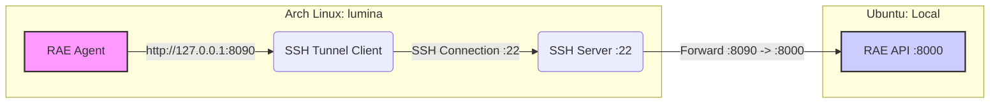

# RAE Remote Node Connection Architecture

This document describes the infrastructure established to connect remote compute nodes (e.g., `lumina`, Arch Linux) to the RAE Control Node (local, Ubuntu), bypassing network isolation issues (different Tailscale accounts).

## Architecture Overview

Since the Control Node and Remote Node are on different Tailscale networks, direct P2P communication is not possible by default. To bridge this, a persistent **SSH Reverse Tunnel** is used.



### Components

1.  **Local Machine (Control Node)**
    *   **Service:** `rae-tunnel.service` (Systemd)
    *   **Tool:** `autossh` (for persistence) + `sshpass` (for non-interactive auth)
    *   **Function:** Connects to Remote Node and opens a reverse tunnel.
    *   **Command:** `ssh -R 8090:localhost:8000 ...`
    *   **Effect:** Forwards traffic from Remote Node's port `8090` to Local Machine's port `8000` (RAE API).

2.  **Remote Node (Compute Node)**
    *   **Service:** `rae-node.service` (Systemd)
    *   **Agent Config:** `rae_endpoint: http://127.0.0.1:8090`
    *   **Function:** Sends Heartbeats and Polls for tasks via `localhost:8090`.
    *   **Traffic Flow:** `Agent -> localhost:8090 -> SSH Tunnel -> Localhost:8000 (API)`

## Operational Guide

### 1. Connection Persistence
The connection is managed by `systemd` on the Local Machine. It automatically starts on boot (`Restart=always`).

- **Check Status:** `systemctl status rae-tunnel`
- **Restart Tunnel:** `sudo systemctl restart rae-tunnel`

### 2. Node Agent
The Remote Node runs the agent autonomously.

- **Check Remote Status (via SSH):**
  ```bash
  ssh operator@ssh.colorworld.pl "systemctl status rae-node"
  ```

### 3. Troubleshooting
If the node appears `OFFLINE` in RAE Dashboard:

1.  **Check Local Tunnel:** ensure `rae-tunnel` is active.
2.  **Check Remote Port:** SSH to remote and run `ss -tln | grep 8090`. It should be listening.
3.  **Check Remote Logs:** `journalctl -u rae-node -f` on remote.

## Security Note
*   The SSH password is provided securely via environment variables/scripts to `sshpass`.
*   The tunnel is bound to `localhost` interfaces, minimizing exposure.
