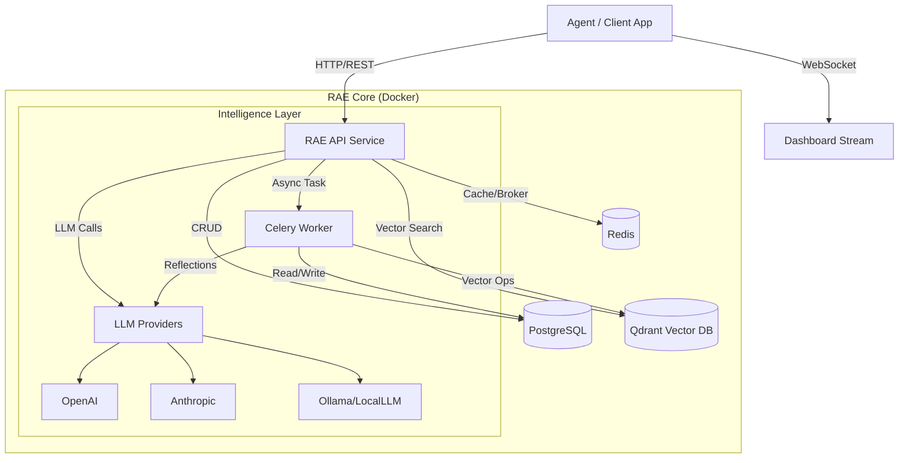

# RAE Developer Handbook: The Complete Engineering Guide

> **Version:** 2.2.0-enterprise
> **Audience:** Software Engineers, AI Engineers, System Architects
> **Goal:** To provide a comprehensive, code-first guide to understanding, deploying, and integrating with the Reflective Agentic-memory Engine.

---

## 1. Introduction: Beyond Vector Databases

As an engineer building AI agents, you are likely familiar with the limitations of standard RAG (Retrieval-Augmented Generation):
1.  **Context Window Flooding:** Filling the prompt with marginally relevant chunks degrades reasoning quality.
2.  **Loss of Procedural Knowledge:** Vector DBs store *facts* but struggle with *procedures* ("how we did X last time") and *reasoning* ("why we chose Y over Z").
3.  **Ephemeral Memory:** Agents start fresh every session or rely on primitive sliding windows.

**RAE (Reflective Agentic-memory Engine)** is designed to solve these specific engineering challenges. It is not just a database; it is a **cognitive architecture** that acts as a persistent, learning memory layer for your agents.

### 1.1 The "3x First" Engineering Philosophy

-   **Privacy-First:** We assume you run in a VPC or air-gapped environment. No telemetry leaves your containers unless explicitly configured.
-   **Local-First:** Docker Compose is a first-class citizen. You can run the entire stack on a MacBook Pro or a single EC2 instance.
-   **Open-Source-First:** The core logic is Apache 2.0. No "open core" crippling of essential APIs.

---

## 2. System Architecture

RAE follows a clean, hexagonal-inspired architecture to ensure modularity and testability.

### 2.1 High-Level Component Diagram



### 2.2 Data Flow: The Memory Lifecycle

1.  **Ingestion (Episodic):** Raw events (user msg, tool output) are stored in `episodic_memory` (PostgreSQL) and embedded (Qdrant).
2.  **Consolidation (Semantic):** Background workers (Celery) analyze episodes to extract entities and facts, updating the Knowledge Graph.
3.  **Retrieval (Working):** When a query arrives:
    *   **Vector Search:** Finds semantically similar items.
    *   **Graph Traversal:** Finds related entities (2-hop).
    *   **Information Bottleneck:** A mathematical optimization algorithm selects the *optimal* subset of memories to fit the context window budget.
4.  **Reflection (Reflective):** After a task, the engine evaluates success/failure and generates a "Lesson Learned," stored in `reflective_memory` for future retrieval.

---

## 3. Quick Start: Local Development

For everyday development, we recommend the Docker Compose setup.

### 3.1 Prerequisites
-   Docker Engine 24+ & Docker Compose v2
-   Python 3.11+ (for local SDK/testing)
-   Git

### 3.2 Setup

```bash
# 1. Clone
git clone https://github.com/dreamsoft-pro/RAE-agentic-memory.git
cd RAE-agentic-memory

# 2. Configure Environment
cp .env.example .env
# Edit .env to add your API keys (OPENAI_API_KEY, etc.) if using cloud models.
# For local models, configure OLLAMA_BASE_URL.

# 3. Start RAE Lite (Minimal stack: API, DB, Redis, Qdrant)
./scripts/setup_autostart.sh
# OR manually:
docker compose -f docker-compose.lite.yml up -d
```

### 3.3 Verifying the Deployment

-   **Health Check:** `curl http://localhost:8000/health`
-   **API Docs:** Open `http://localhost:8000/docs` (Swagger UI)
-   **Dashboard:** Open `http://localhost:8501` (if running full stack)

---

## 4. API Reference Cookbook

This section provides practical, copy-pasteable examples for common tasks.

### 4.1 Storing a Memory

**Use Case:** Your agent just completed a step or received user input.

**Python SDK:**
```python
from rae_memory_sdk import MemoryClient

client = MemoryClient(base_url="http://localhost:8000")

async def store_interaction():
    await client.add_memory(
        tenant_id="default",
        project_id="my-agent",
        content="User requested a refund for order #999. Refund policy checked: valid.",
        source="agent-conversation-log",
        layer="episodic",  # 'episodic' is for raw events
        tags=["refund", "customer-service", "order-999"]
    )
```

**cURL:**
```bash
curl -X POST "http://localhost:8000/v1/memory/store" \
     -H "X-Tenant-Id: default" \
     -H "Content-Type: application/json" \
     -d 
{
           "project_id": "my-agent",
           "content": "User requested a refund...",
           "layer": "episodic",
           "source": "curl-test"
         }
```

### 4.2 Querying Memory (Hybrid Search)

**Use Case:** Your agent needs context before answering a user.

**Python SDK:**
```python
async def get_context(user_query: str):
    results = await client.query_memory(
        tenant_id="default",
        project_id="my-agent",
        query_text=user_query,
        limit=5,
        # Hybrid Search Parameters
        filters={
            "layer": ["episodic", "semantic"],
            "tags": ["customer-service"]
        }
    )
    
    context_str = "\n".join([f"- {r.content}" for r in results])
    return context_str
```

### 4.3 Triggering a Reflection

**Use Case:** The task is finished. Force the system to learn from it.

**Python SDK:**
```python
async def reflect_on_task():
    # Typically, reflections run in background, but you can force one
    await client.trigger_reflection(
        tenant_id="default",
        project_id="my-agent",
        context_summary="Handled refund #999 successfully. Used Policy v2.",
        outcome="success"
    )
```

---

## 5. Configuration & Environment Variables

RAE is highly configurable via environment variables.

| Variable | Default | Description |
| :--- | :--- | :--- |
| `POSTGRES_HOST` | `postgres` | Database hostname |
| `QDRANT_HOST` | `qdrant` | Vector DB hostname |
| `RAE_VECTOR_BACKEND` | `qdrant` | `qdrant` or `pgvector` |
| `ML_SERVICE_URL` | `http://ml-service:8001` | URL for external ML/Embedding service |
| `LOG_LEVEL` | `INFO` | `DEBUG`, `INFO`, `WARNING`, `ERROR` |
| `OTEL_TRACES_ENABLED` | `true` | Enable OpenTelemetry tracing |
| `OPENAI_API_KEY` | - | Required if using OpenAI for reflections |
| `OLLAMA_BASE_URL` | - | Required if using local LLMs |

---

## 6. Advanced Integration: MCP Server

RAE implements the **Model Context Protocol (MCP)**, allowing it to be used natively by AI coding assistants like Claude Desktop or IDE extensions.

### 6.1 Configuration (`claude_desktop_config.json`)

```json
{
  "mcpServers": {
    "rae": {
      "command": "docker",
      "args": [
        "exec",
        "-i",
        "rae-api",
        "rae-mcp-server"
      ],
      "env": {
        "RAE_API_URL": "http://localhost:8000"
      }
    }
  }
}
```

This allows you to ask Claude: *"Check RAE memory for past solutions to this bug"* directly within your chat.

---

## 7. Troubleshooting & Debugging

### 7.1 Common Issues

**Issue: "Connection Refused" to Database**
-   **Check:** Is the container running? `docker compose ps`
-   **Check:** Logs `docker compose logs postgres`
-   **Fix:** Ensure volumes are not corrupted. Try `docker compose down -v` to reset data (WARNING: data loss).

**Issue: LLM Authentication Error**
-   **Check:** `.env` file for valid API keys.
-   **Check:** Are keys passed to the container? Inspect `docker compose config`.

**Issue: Migrations Failed (`alembic`)
-   **Fix:** Run `docker compose exec rae-api alembic upgrade head` manually.

### 7.2 Accessing Logs

-   **API Logs:** `docker compose logs -f rae-api`
-   **Worker Logs:** `docker compose logs -f celery-worker`
-   **Database Logs:** `docker compose logs -f postgres`

### 7.3 Accessing the Database Directly

```bash
# PostgreSQL CLI
docker compose exec postgres psql -U rae -d rae

# Redis CLI
docker compose exec redis redis-cli
```

---

## 8. Developing RAE (Contributing)

If you want to modify RAE source code itself:

1.  **Install Dev Dependencies:**
    ```bash
    python -m venv .venv
    source .venv/bin/activate
    pip install -r requirements-dev.txt
    pip install -e sdk/python/rae_memory_sdk
    ```

2.  **Run Tests:**
    ```bash
    # Unit tests (fast)
    make test-unit
    
    # Integration tests (requires running containers)
    make test-integration
    ```

3.  **Code Style:**
    We use `ruff`, `black`, and `isort`.
    ```bash
    make format
    make lint
    ```

---

## 9. Next Steps

-   Explore **[Scientific Background](scientist.md)** to understand the math behind the scoring.
-   Check **[Industrial Use Cases](industry.md)** for deployment architectures.
-   Join our **[Discord/Community](link)** to discuss integrations.
