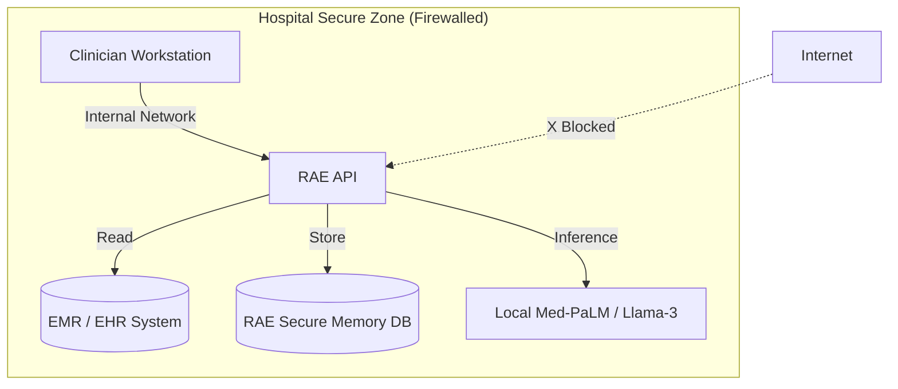

# RAE for Healthcare: Secure Cognitive Memory

> **Version:** 2.2.0-enterprise
> **Audience:** Strategic & Technical Decision Makers in Healthcare
> **Goal:** To outline secure, HIPAA-compliant deployments of RAE for clinical decision support and medical research.

---

## 1. Executive Summary: AI with a Hippocratic Oath

Healthcare AI cannot afford to hallucinate. It requires precision, context, and above all, absolute data privacy. RAE provides a **Self-Reflective Memory** system that grounds AI responses in patient history and established medical protocols (Semantic Memory), reducing the risk of error.

**Why RAE for Healthcare?**
*   **Zero Data Exfiltration:** Run 100% on-premise within your hospital's secure network.
*   **Longitudinal Patient Context:** Instead of stateless chat, RAE remembers the patient's history across years of EMR notes.
*   **Protocol Adherence:** Reflective Memory enforces adherence to clinical guidelines ("Standard of Care").

---

## 2. Security & Compliance (HIPAA / GDPR)

RAE is engineered with "Privacy by Design".

### 2.1 The "No-Cloud" Architecture

Unlike SaaS AI solutions that require sending PHI (Protected Health Information) to external servers, RAE can be deployed entirely within your firewall.

### 2.2 PII/PHI Scrubbing

If you *must* use cloud LLMs (e.g., GPT-4) for advanced reasoning, RAE includes a configured **PII Scrubber**.
*   **Mechanism:** Before sending data to an LLM, RAE detects and redacts names, SSNs, MRNs, and dates.
*   **Re-identification:** Upon receiving the answer, RAE can re-inject the context locally for the clinician.

---

## 3. Use Cases

### 3.1 Clinical Decision Support (CDS)

**Scenario:** A doctor treats a patient with complex comorbidities.
*   **Challenge:** Relevant history is buried in 500 pages of PDF notes from 2018.
*   **RAE Solution:** RAE indexes all past notes (Episodic Memory). When the doctor asks "Has this patient reacted to beta-blockers?", RAE retrieves the specific incident from 2019, cites the source document, and answers "Yes, mild bradycardia noted in 2019."

### 3.2 Medical Research Cohort Analysis

**Scenario:** Researchers need to find patients matching specific criteria for a trial.
*   **RAE Solution:** RAE builds a Knowledge Graph of patient phenotypes. Researchers can query: "Find patients with Type 2 Diabetes who developed neuropathy within 2 years of diagnosis." RAE performs a graph traversal to find these specific temporal relationships.

---

## 4. Technical Implementation

### 4.1 EMR Integration

RAE is designed to sit *alongside* your EMR (Epic, Cerner), not replace it.
*   **Ingestion:** Use RAE API to ingest HL7/FHIR messages or daily PDF exports.
*   **Linking:** Store the EMR `PatientID` as the RAE `project_id` or `tenant_id` to ensure strict data separation.

### 4.2 Audit Trails

Every retrieval is logged.
*   **Who:** Dr. Smith
*   **When:** 2023-10-27 14:30
*   **Query:** "Show recent labs"
*   **Accessed:** Memory IDs #445, #446 (Lab Results)

This log is immutable and available for compliance audits.

---

## 5. Getting Started

1.  **Review Security:** Discuss the [Architecture](../paths/industry.md) with your SecOps team.
2.  **Pilot:** Deploy RAE Lite on a secure, offline laptop to test capability.
3.  **Deploy:** Use the **Proxmox HA** profile for hospital-wide deployment.
