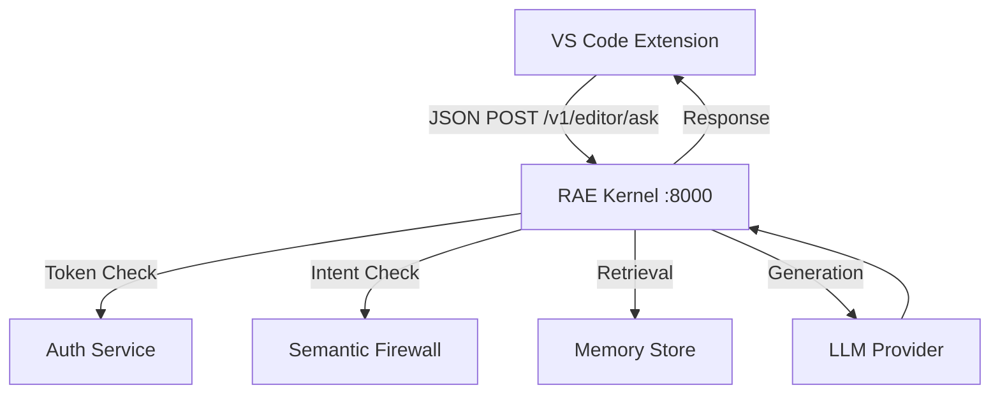

# RAE EDITOR PROTOCOL (v1.0)
**Status:** DRAFT
**Type:** JSON-RPC over HTTP
**Goal:** Integrate IDEs (VSCode, JetBrains) as "Dumb Terminals" for RAE. The IDE provides UI, RAE provides Intelligence.

## 1. Philosophy
- **The IDE is NOT the Agent.** The IDE is a viewport.
- **No Local LLM SDKs.** The extension must NOT import `openai` or `langchain`.
- **Stateless.** The extension sends context, RAE sends diffs.

## 2. Architecture



## 3. API Specification

### Endpoint: `POST /v1/editor/ask`

#### Request Payload
```json
{
  "intent": "refactor_code",
  "file_context": {
    "path": "src/main.py",
    "content": "def foo(): pass",
    "cursor_line": 10,
    "selection": null
  },
  "project_context": {
    "root": "/home/user/project",
    "git_branch": "feature/login"
  }
}
```

#### Response Payload
```json
{
  "success": true,
  "action": "apply_diff",
  "data": {
    "diff": "--- src/main.py\n+++ src/main.py\n@@ -10,1 +10,2 @@\n-def foo(): pass\n+def foo():\n+    return True",
    "explanation": "Added return statement."
  },
  "cost": 0.0002
}
```

## 4. Security Rules for Extensions
1. **Never store API Keys for LLM Providers.** Only store the `RAE_KERNEL_KEY`.
2. **Never execute code generated by LLM automatically.** Always present a Diff View for user approval.
3. **Respect `.raeignore`.** Do not send ignored files to the Kernel.

## 5. Implementation Roadmap
- [ ] Create `rae-vscode-client` (TypeScript, fetch-only).
- [ ] Implement `/v1/editor/ask` in RAE API.
- [ ] Add `EditorService` to RAE Core.
