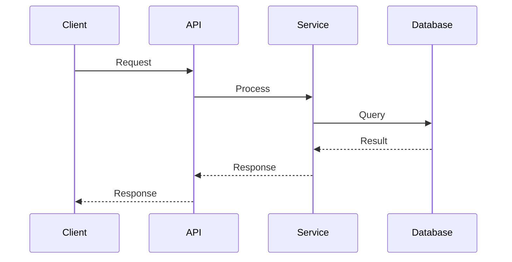

# [System/Component] Architecture

**Status:** [Proposed / Active / Deprecated]
**Version:** [X.Y.Z]
**Last Updated:** [YYYY-MM-DD]

## Executive Summary

[1-2 paragraph high-level overview of the architecture]

## Context

### Business Requirements

- [Requirement 1]
- [Requirement 2]
- [Requirement 3]

### Technical Constraints

- [Constraint 1]
- [Constraint 2]
- [Constraint 3]

### Assumptions

- [Assumption 1]
- [Assumption 2]
- [Assumption 3]

## Architectural Goals

1. **[Goal 1 - e.g., Scalability]**
   - Target: [Specific metric]
   - Why: [Rationale]

2. **[Goal 2 - e.g., Reliability]**
   - Target: [Specific metric]
   - Why: [Rationale]

3. **[Goal 3 - e.g., Performance]**
   - Target: [Specific metric]
   - Why: [Rationale]

## High-Level Architecture

```
[ASCII diagram or mermaid diagram]

┌─────────────┐     ┌─────────────┐     ┌─────────────┐
│   Client    │────▶│     API     │────▶│  Database   │
└─────────────┘     └─────────────┘     └─────────────┘
```

### Components

#### Component 1: [Name]

**Responsibility:** [What this component does]

**Technologies:**
- [Tech stack]

**Interfaces:**
- Input: [What it receives]
- Output: [What it produces]

#### Component 2: [Name]

**Responsibility:** [What this component does]

**Technologies:**
- [Tech stack]

**Interfaces:**
- Input: [What it receives]
- Output: [What it produces]

## Detailed Design

### Data Flow

```
[Step-by-step data flow diagram]

1. Client Request → API Gateway
2. API Gateway → Authentication Service
3. Authentication Service → Business Logic
4. Business Logic → Database
5. Database → Response to Client
```

### Component Interactions



### Data Models

#### Entity: [EntityName]

**Schema:**

```python
class EntityName(BaseModel):
    id: UUID
    tenant_id: UUID
    field1: str
    field2: int
    created_at: datetime
    updated_at: datetime
```

**Relationships:**
- Has many: [RelatedEntity]
- Belongs to: [ParentEntity]

**Indexes:**
- Primary: `id`
- Unique: `(tenant_id, field1)`
- Index: `tenant_id`, `created_at`

### API Contracts

#### Endpoint: `POST /api/v1/resource`

**Request:**

```json
{
  "field1": "value",
  "field2": 123
}
```

**Response (200 OK):**

```json
{
  "id": "uuid",
  "field1": "value",
  "field2": 123,
  "created_at": "2024-01-01T00:00:00Z"
}
```

**Error Response (400 Bad Request):**

```json
{
  "error": "Validation error",
  "details": ["field1 is required"]
}
```

## Technology Stack

### Core Technologies

| Component | Technology | Version | Rationale |
|-----------|-----------|---------|-----------|
| API Framework | FastAPI | 0.100+ | [Why chosen] |
| Database | PostgreSQL | 15+ | [Why chosen] |
| Cache | Redis | 7+ | [Why chosen] |

### Supporting Technologies

- **Monitoring:** [Tool] - [Why]
- **Logging:** [Tool] - [Why]
- **Tracing:** [Tool] - [Why]

## Scalability

### Horizontal Scaling

- **API Tier:** [How to scale]
- **Worker Tier:** [How to scale]
- **Database Tier:** [How to scale]

### Vertical Scaling

- **Memory Requirements:** [Estimates]
- **CPU Requirements:** [Estimates]
- **Storage Requirements:** [Estimates]

### Load Distribution

- **Load Balancer:** [Configuration]
- **Sharding Strategy:** [If applicable]
- **Caching Strategy:** [What is cached]

## Performance

### Performance Targets

| Operation | Target Latency | Target Throughput |
|-----------|---------------|-------------------|
| Read | < 100ms | 1000 req/s |
| Write | < 500ms | 100 req/s |
| Batch | < 5s | 10 batches/s |

### Optimization Strategies

1. **[Strategy 1]**
   - Implementation: [How]
   - Impact: [Expected improvement]

2. **[Strategy 2]**
   - Implementation: [How]
   - Impact: [Expected improvement]

## Security

### Authentication & Authorization

- **Method:** [e.g., JWT, OAuth2]
- **Token Lifetime:** [Duration]
- **Refresh Strategy:** [How tokens are refreshed]

### Data Protection

- **Encryption at Rest:** [Method]
- **Encryption in Transit:** [Method - e.g., TLS 1.3]
- **Tenant Isolation:** [How enforced]

### Security Best Practices

- [ ] All queries include `tenant_id`
- [ ] Input validation on all endpoints
- [ ] Rate limiting enabled
- [ ] SQL injection prevention
- [ ] XSS prevention
- [ ] CORS properly configured

## Reliability

### High Availability

- **Target Uptime:** [e.g., 99.9%]
- **Redundancy:** [How components are redundant]
- **Failover:** [Failover strategy]

### Disaster Recovery

- **RTO (Recovery Time Objective):** [Duration]
- **RPO (Recovery Point Objective):** [Duration]
- **Backup Strategy:** [How and when]
- **Restore Procedure:** [Steps to restore]

### Error Handling

```python
# Error handling pattern
try:
    result = operation()
except SpecificError as e:
    logger.error("Operation failed", error=str(e))
    raise HTTPException(status_code=500, detail="Internal error")
```

## Observability

### Metrics

| Metric | Type | Purpose |
|--------|------|---------|
| `api.requests.total` | Counter | Track request volume |
| `api.request.duration` | Histogram | Monitor latency |
| `api.errors.total` | Counter | Track errors |

### Logging

**Log Format:**

```json
{
  "timestamp": "2024-01-01T00:00:00Z",
  "level": "info",
  "service": "service-name",
  "operation": "operation-name",
  "tenant_id": "tenant-uuid",
  "duration_ms": 123,
  "status": "success"
}
```

### Alerting

| Alert | Condition | Severity | Action |
|-------|-----------|----------|--------|
| High Error Rate | errors > 5% | Critical | Page on-call |
| High Latency | p95 > 1s | Warning | Investigate |
| Low Disk Space | disk < 10% | Critical | Scale storage |

## Deployment

### Infrastructure

- **Environment:** [Cloud provider / On-premise]
- **Orchestration:** [Kubernetes / Docker Compose]
- **Configuration:** [How config is managed]

### Deployment Strategy

- **Strategy Type:** [Blue-Green / Rolling / Canary]
- **Rollback Plan:** [How to rollback]
- **Health Checks:** [What is checked]

### CI/CD Pipeline

```
[Pipeline stages]

1. Code Push
2. Lint & Test
3. Build Container
4. Deploy to Staging
5. Integration Tests
6. Deploy to Production
7. Smoke Tests
```

## Testing Strategy

### Test Pyramid

- **Unit Tests:** [Coverage target]
- **Integration Tests:** [Coverage target]
- **E2E Tests:** [Coverage target]

### Test Environments

| Environment | Purpose | Data |
|-------------|---------|------|
| Development | Local development | Fake data |
| Staging | Pre-production testing | Anonymized prod data |
| Production | Live system | Real data |

## Monitoring & Operations

### Operational Runbooks

- [Link to runbook 1]
- [Link to runbook 2]

### Maintenance Windows

- **Frequency:** [e.g., Monthly]
- **Duration:** [e.g., 2 hours]
- **Communication:** [How users are notified]

## Trade-offs & Decisions

### Decision 1: [Technology/Pattern Choice]

**Options Considered:**
1. [Option A] - [Pros/Cons]
2. [Option B] - [Pros/Cons]
3. [Option C] - [Pros/Cons]

**Decision:** [Chosen option]

**Rationale:** [Why this was chosen]

### Decision 2: [Another Decision]

**Options Considered:**
1. [Option A] - [Pros/Cons]
2. [Option B] - [Pros/Cons]

**Decision:** [Chosen option]

**Rationale:** [Why this was chosen]

## Future Considerations

### Planned Improvements

- [ ] [Improvement 1] - [Timeline]
- [ ] [Improvement 2] - [Timeline]
- [ ] [Improvement 3] - [Timeline]

### Known Limitations

1. **[Limitation 1]**
   - Impact: [What is affected]
   - Mitigation: [Current workaround]
   - Fix: [Planned solution]

2. **[Limitation 2]**
   - Impact: [What is affected]
   - Mitigation: [Current workaround]
   - Fix: [Planned solution]

## References

### Internal Documentation

- [Link to related architecture doc]
- [Link to API reference]
- [Link to operations guide]

### External Resources

- [External standard/specification]
- [Research paper]
- [Best practices guide]

### Related ADRs (Architecture Decision Records)

- [ADR-001: Decision Title]
- [ADR-002: Another Decision]

---

**Architecture Owner:** [Name/Team]
**Review Cycle:** [Quarterly / Annually]
**Next Review:** [YYYY-MM-DD]
