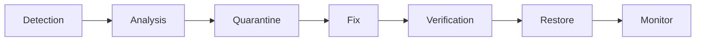

# Flaky Test Policy

**Generated:** 2025-12-08
**Version:** 1.0
**Part of:** RAE CI Quality Implementation - Iteration 2: Zero Flake

## Executive Summary

This document defines the policy and procedures for detecting, managing, and eliminating flaky tests in the RAE project. A flaky test is a test that exhibits non-deterministic behavior - sometimes passing and sometimes failing without any code changes.

### Policy Statement

**ZERO FLAKY TESTS IN MAIN SUITE**

All tests in the main test suite must be deterministic and produce consistent results across multiple runs. Flaky tests undermine CI reliability and must be either:
1. Fixed within 5 working days (SLA-2), or
2. Moved to quarantine until fixed

---

## What is a Flaky Test?

A test is considered flaky if:
- It produces different outcomes (pass/fail) across multiple runs with identical code
- It depends on timing, external services, or non-deterministic data
- It has race conditions or improper async handling
- It exhibits environment-dependent behavior (order sensitivity, shared state)

### Common Causes of Flakiness

| Cause | Example | Fix Strategy |
|-------|---------|--------------|
| **Timing Issues** | `time.sleep(0.1)` not enough | Use explicit waits, increase timeout |
| **Race Conditions** | Concurrent access to shared state | Add locks, proper synchronization |
| **External Dependencies** | Real API calls, network requests | Mock external services |
| **Random Data** | `random.randint()` without seed | Set seed: `random.seed(42)` |
| **Time-based Logic** | `datetime.now()` in assertions | Use `freezegun` to freeze time |
| **Test Order Dependency** | Tests affect each other's state | Ensure proper isolation with fixtures |
| **Async Operations** | Missing `await` or timeouts | Add proper async waits |

---

## Flaky Test Lifecycle



### 1. Detection

Flaky tests are detected through:

#### Automated Detection (Nightly)
The `flaky-detection` CI job runs nightly and on-demand:

```bash
# Trigger manual flaky check
git commit -m "feat: new feature [flaky-check]"
```

The job:
- Runs the full test suite 3 times
- Compares outcomes across runs
- Generates `flaky_report.json` artifact
- Fails if flaky tests are detected

#### Manual Detection
If you suspect a test is flaky:

```bash
# Run test multiple times locally
for i in {1..10}; do
  pytest tests/path/to/test.py::test_name -v || echo "FAIL $i"
done
```

### 2. Analysis

When a flaky test is detected, analyze it using:

```bash
# Generate detailed flaky analysis
python scripts/ci/analyze_flaky_tests.py \
  run_1.json run_2.json run_3.json \
  --output flaky_report.json
```

The report includes:
- Pass rate across runs
- Average duration
- Failure patterns
- Fix recommendations

**Example report:**

```json
{
  "total_tests": 860,
  "flaky_tests": [
    {
      "nodeid": "tests/api/v1/test_cache.py::test_concurrent_access",
      "outcomes": ["passed", "failed", "passed"],
      "pass_rate": 0.67,
      "avg_duration_seconds": 2.341,
      "recommendation": "Test fails frequently - likely timing/race condition issue"
    }
  ],
  "stable_tests_count": 859,
  "analysis_runs": 3
}
```

### 3. Quarantine

Move the flaky test to quarantine to prevent blocking CI:

```bash
# Quarantine a flaky test
python scripts/ci/quarantine_test.py \
  tests/api/v1/test_cache.py::test_concurrent_access \
  --reason "race condition in concurrent access"
```

This will:
1. Copy the test file to `tests/quarantine/` (mirroring original structure)
2. Add quarantine marker and skip decorator
3. Preserve original location information
4. Generate instructions for fixing

**Quarantined tests are:**
- Excluded from main CI runs
- Tracked in `tests/quarantine/README.md`
- Assigned a fix ticket with P1 priority
- Subject to 5-day SLA for resolution

### 4. Fix

Common fix strategies:

#### For Timing Issues
```python
# BEFORE (flaky)
def test_async_operation():
    trigger_async_task()
    time.sleep(0.1)  # Hope it completes
    assert task.is_done()

# AFTER (deterministic)
def test_async_operation():
    trigger_async_task()
    # Explicit wait with timeout
    for _ in range(50):
        if task.is_done():
            break
        time.sleep(0.1)
    else:
        pytest.fail("Task did not complete within 5s")
    assert task.is_done()
```

#### For External Dependencies
```python
# BEFORE (flaky - depends on network)
def test_fetch_data():
    response = requests.get("https://api.example.com/data")
    assert response.status_code == 200

# AFTER (deterministic - mocked)
def test_fetch_data(mocker):
    mock_response = mocker.Mock()
    mock_response.status_code = 200
    mocker.patch("requests.get", return_value=mock_response)

    response = requests.get("https://api.example.com/data")
    assert response.status_code == 200
```

#### For Random Data
```python
# BEFORE (flaky)
def test_random_selection():
    items = random.sample(range(100), 10)
    assert len(items) == 10

# AFTER (deterministic)
def test_random_selection():
    random.seed(42)  # Consistent seed
    items = random.sample(range(100), 10)
    assert len(items) == 10
    assert items[0] == 81  # Can now assert specific values
```

#### For Time-based Logic
```python
# BEFORE (flaky)
def test_expiration():
    item = create_item(expires_in=1)
    time.sleep(2)
    assert item.is_expired()

# AFTER (deterministic)
from freezegun import freeze_time

def test_expiration():
    with freeze_time("2025-01-01 12:00:00"):
        item = create_item(expires_in=1)

    with freeze_time("2025-01-01 12:00:02"):
        assert item.is_expired()
```

#### For Race Conditions
```python
# BEFORE (flaky)
def test_concurrent_access():
    cache = Cache()

    def writer():
        cache.set("key", "value")

    def reader():
        return cache.get("key")

    thread1 = Thread(target=writer)
    thread2 = Thread(target=reader)
    thread1.start()
    thread2.start()
    thread1.join()
    thread2.join()
    # Race condition - reader might run before writer

# AFTER (deterministic)
import threading

def test_concurrent_access():
    cache = Cache()
    barrier = threading.Barrier(2)  # Synchronization

    def writer():
        barrier.wait()  # Wait for both threads
        cache.set("key", "value")

    def reader():
        barrier.wait()
        time.sleep(0.1)  # Ensure writer goes first
        return cache.get("key")

    thread1 = Thread(target=writer)
    thread2 = Thread(target=reader)
    thread1.start()
    thread2.start()
    thread1.join()
    thread2.join()
    assert cache.get("key") == "value"
```

### 5. Verification

After fixing, verify stability:

```bash
# Run test 20+ times to verify fix
for i in {1..20}; do
  pytest tests/path/to/test.py::test_name -v
  if [ $? -ne 0 ]; then
    echo "FAILED on run $i"
    exit 1
  fi
done

echo "All 20 runs passed - test is stable"
```

### 6. Restore

Once verified:

```bash
# Move test back to main suite
mv tests/quarantine/api/v1/test_cache.py tests/api/v1/test_cache.py

# Remove quarantine markers from the file
# Open PR with fix and verification results
```

### 7. Monitor

After restoration:
- Monitor test for 1 week in CI
- Review `flaky-detection` reports
- Re-quarantine if flakiness returns

---

## Using the Flaky Detection Tools

### analyze_flaky_tests.py

**Purpose:** Analyze test outcomes across multiple runs to identify flaky tests

**Usage:**
```bash
python scripts/ci/analyze_flaky_tests.py \
  run_1.json run_2.json run_3.json \
  --output flaky_report.json \
  --min-runs 3
```

**Parameters:**
- `reports` (positional): pytest-json-report files from multiple runs
- `--output`, `-o`: Output JSON file (default: `flaky_report.json`)
- `--min-runs`: Minimum runs required to classify (default: 3)

**Output Format:**
```json
{
  "total_tests": 860,
  "flaky_tests": [
    {
      "nodeid": "tests/...",
      "outcomes": ["passed", "failed", "passed"],
      "pass_rate": 0.67,
      "avg_duration_seconds": 2.341,
      "recommendation": "..."
    }
  ],
  "stable_tests_count": 859,
  "analysis_runs": 3
}
```

### quarantine_test.py

**Purpose:** Move a flaky test to quarantine directory

**Usage:**
```bash
python scripts/ci/quarantine_test.py \
  tests/api/v1/test_cache.py::test_flaky_function \
  --reason "timing issue in async operation"
```

**Parameters:**
- `nodeid` (positional): Full pytest nodeid of the test
- `--reason`: Reason for quarantine (default: "flaky")

**What it does:**
1. Copies test file to `tests/quarantine/` (preserving structure)
2. Adds quarantine header with metadata
3. Adds `@pytest.mark.skip` decorator
4. Prints next steps

**Example output:**
```
✅ Test quarantined: tests/quarantine/api/v1/test_cache.py
📝 Next step: Create ticket to fix and move back to main suite
```

---

## Quarantine Directory Structure

```
tests/
  quarantine/           # Quarantined flaky tests
    __init__.py
    README.md           # Quarantine documentation
    api/
      v1/
        test_cache.py   # Quarantined test (with markers)
    services/
      test_async.py     # Another quarantined test
```

### Quarantine Metadata

Each quarantined test file includes:

```python
"""
QUARANTINED: timing issue in async operation
Original: tests/api/v1/test_cache.py
Nodeid: tests/api/v1/test_cache.py::test_flaky_function
Date: 2025-12-08T10:30:00

This test has been identified as flaky and moved to quarantine.
See tests/quarantine/README.md for fixing guidelines.
"""
import pytest

pytestmark = pytest.mark.skip(reason="Quarantined flaky test - timing issue")

# Original test code follows...
```

---

## CI Integration

### Nightly Flaky Detection Job

The `flaky-detection` job runs:
- **When:** Nightly at 2 AM UTC (cron: `0 2 * * *`)
- **Trigger:** Manual via commit message `[flaky-check]`
- **Duration:** ~15-20 minutes (3x full test suite)

**Workflow:**
```yaml
flaky-detection:
  runs-on: ubuntu-latest
  if: github.event_name == 'schedule' || contains(github.event.head_commit.message, '[flaky-check]')

  steps:
    # ... setup ...

    - name: Run tests 3 times
      run: |
        for i in 1 2 3; do
          pytest --json-report --json-report-file=run_$i.json
        done

    - name: Analyze flakiness
      run: |
        python scripts/ci/analyze_flaky_tests.py \
          run_1.json run_2.json run_3.json \
          --output flaky_report.json

    - name: Fail if flaky tests found
      run: |
        FLAKY_COUNT=$(jq '.flaky_tests | length' flaky_report.json)
        if [ "$FLAKY_COUNT" -gt 0 ]; then
          echo "❌ Found $FLAKY_COUNT flaky tests!"
          exit 1
        fi
```

### Accessing Reports

```bash
# Download latest flaky report from CI
gh run download $(gh run list --workflow=ci.yml --limit=1 --json databaseId -q '.[0].databaseId') \
  --name flaky-report

# View report
cat flaky_report.json | jq '.flaky_tests'
```

---

## SLA and Response Times

Per `RAE-CI-QUALITY-SPEC-enterprise-v2.0.md`:

| Metric | Target | Enforcement |
|--------|--------|-------------|
| **SLA-2: Time to Fix/Quarantine** | 5 working days | Tracked in tickets |
| **Detection Time** | < 24 hours | Nightly job |
| **Quarantine Backlog** | < 10 tests | Weekly review |
| **Fix Rate** | >= 2 tests/week | Team metric |

### SLA Workflow

1. **Day 0:** Flaky test detected by CI
2. **Day 1:** Ticket created (P1 priority)
3. **Day 2-4:** Investigation and fix development
4. **Day 5:** Test fixed and verified, or moved to quarantine if not yet fixed
5. **Week 2+:** Quarantined test must be fixed and restored

---

## pytest.ini Configuration

Add flaky and quarantine markers:

```ini
[pytest]
markers =
    flaky: marks tests as flaky (deselect with '-m "not flaky"')
    quarantine: marks tests in quarantine (skipped by default)

testpaths =
    apps/memory_api/tests
    integrations/context-watcher/tests
    tests
    # NOTE: tests/quarantine is NOT included by default
```

---

## Best Practices

### For Developers

1. **Write Deterministic Tests**
   - Avoid `time.sleep()` for synchronization
   - Mock external dependencies
   - Set random seeds
   - Use `freezegun` for time-based tests

2. **Run Multiple Times Locally**
   ```bash
   # Before committing
   for i in {1..5}; do pytest tests/new_test.py; done
   ```

3. **Follow AGENT_TESTING_GUIDE.md**
   - Zero warnings policy
   - Tests as contracts
   - Proper isolation

4. **Document Assumptions**
   ```python
   def test_cache_expiry():
       """Test cache expiration.

       Assumptions:
       - Time is frozen using freezegun
       - Cache backend is Redis (mocked)
       - Expiry granularity is 1 second
       """
       ...
   ```

### For Reviewers

1. **Check for Flakiness Indicators**
   - Look for timing dependencies
   - Check for external service calls
   - Verify proper mocking
   - Review async/await usage

2. **Require Multiple Local Runs**
   - Ask author to run test 10+ times
   - Check CI history for previous flakiness

3. **Reject Tests with Warnings**
   - Enforce ZERO WARNINGS policy
   - No `warnings.filterwarnings` in tests

---

## Troubleshooting

### Q: Why was my test quarantined?

**A:** Check the quarantine marker in the test file:
```bash
grep -A 5 "QUARANTINED:" tests/quarantine/path/to/test.py
```

Download the `flaky_report.json` from the CI run that detected it.

### Q: How do I run quarantined tests locally?

**A:** Explicitly run the quarantine directory:
```bash
# Run all quarantined tests
pytest tests/quarantine/ -v

# Run specific quarantined test
pytest tests/quarantine/api/v1/test_cache.py::test_name -v
```

### Q: Can I skip the flaky check for my PR?

**A:** No. The flaky-detection job runs nightly and does not block PRs. If you need to verify your changes don't introduce flakiness:
```bash
git commit -m "feat: my feature [flaky-check]"
```

### Q: How do I know if my fix worked?

**A:** Run the test 20+ times locally with no failures:
```bash
for i in {1..20}; do
  pytest tests/path/to/test.py::test_name -v || exit 1
done
```

Then create a PR and monitor CI for 1 week.

### Q: What if a test is flaky only in CI?

**A:** This indicates an environment difference. Check:
- CPU/memory constraints
- Parallel test execution
- Container networking
- Database connection pools
- Redis/Qdrant timeouts

Add more generous timeouts or explicit waits.

---

## Metrics and Monitoring

### Key Metrics

Track these in your team dashboard:

```python
# Example metrics to collect
flaky_metrics = {
    "total_quarantined": len(list(Path("tests/quarantine").rglob("test_*.py"))),
    "avg_time_to_fix_days": 3.2,
    "fix_rate_per_week": 2.1,
    "false_positive_rate": 0.03,  # Incorrectly marked as flaky
    "reoccurrence_rate": 0.05,  # Fixed tests that became flaky again
}
```

### Weekly Review

Every Monday:
1. Review `tests/quarantine/` directory
2. Check open tickets for quarantined tests
3. Verify fixes have been deployed
4. Update team on progress

---

## FAQ

**Q: Do I need to run `flaky-detection` for every PR?**
A: No, it runs nightly. Only use `[flaky-check]` if you suspect a test is flaky.

**Q: Can I mark a test as flaky instead of quarantining?**
A: No. Use quarantine. The `@pytest.mark.flaky` marker is not used in RAE.

**Q: What if I can't fix a flaky test in 5 days?**
A: Quarantine it and create a ticket. The quarantine directory allows the test to be fixed without blocking CI.

**Q: How do I prevent flaky tests in the first place?**
A: Follow the best practices above:
- Mock external dependencies
- Use `freezegun` for time
- Set random seeds
- Add explicit waits
- Run tests multiple times locally

**Q: Can I use `pytest-rerunfailures` to retry flaky tests?**
A: No. Retries hide the problem. Fix the root cause instead.

---

## References

### Related Documentation
- `docs/RAE-CI-QUALITY-IMPLEMENTATION-PLAN.md` - Overall CI quality plan
- `docs/AGENT_TESTING_GUIDE.md` - General testing guidelines
- `tests/quarantine/README.md` - Quarantine directory documentation

### Related Scripts
- `scripts/ci/analyze_flaky_tests.py` - Flaky detection analyzer
- `scripts/ci/quarantine_test.py` - Test quarantine tool
- `.github/workflows/ci.yml` - CI workflow with flaky-detection job

### External Resources
- [Pytest Best Practices](https://docs.pytest.org/en/stable/goodpractices.html)
- [Martin Fowler on Eradicating Non-Determinism](https://martinfowler.com/articles/nonDeterminism.html)
- [Google Testing Blog: Flaky Tests](https://testing.googleblog.com/2016/05/flaky-tests-at-google-and-how-we.html)

---

## Contact & Support

**Document Owner:** RAE Development Team
**Last Updated:** 2025-12-08
**Next Review:** After Iteration 2 completion

For questions or issues with flaky tests:
- Create an issue with label `testing/flaky`
- Ping `#testing` channel in team chat
- Review quarantine documentation: `tests/quarantine/README.md`
