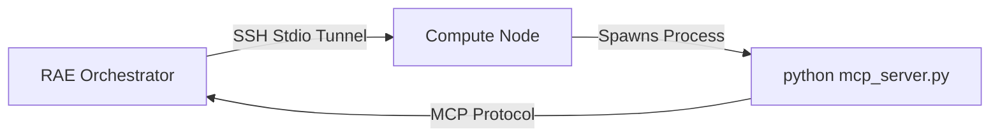

# MCP Compute Node Setup (SSH Transport)

This guide documents the architecture and setup for High-Performance Compute Nodes (like Node2/JULKA) using the Model Context Protocol (MCP) over SSH.

## Architecture

Unlike the previous HTTP-polling agent, the MCP Compute Node architecture is **serverless** (from the node's perspective). The Agent does not run as a daemon. Instead, the Orchestrator connects via SSH and launches the MCP server process on-demand using standard I/O (Stdio).



## Node Configuration (Reference: Node2/JULKA)

- **Host**: `100.70.32.40` (Tailscale IP)
- **User**: `juliazdalnie`
- **Specs**: i9-14900KF, RTX 4080 SUPER, 64GB RAM
- **Path**: `~/rae-node-agent`
- **VirtualEnv**: `~/rae-node-agent/venv`
- **Entrypoint**: `mcp_server.py`

## Setup Instructions for New Nodes

1. **Prepare Directory**:
   ```bash
   mkdir -p ~/rae-node-agent
   cd ~/rae-node-agent
   ```

2. **Install Dependencies**:
   ```bash
   python3 -m venv venv
   source venv/bin/activate
   pip install mcp[cli]
   ```

3. **Deploy Server Code**:
   Copy the template `infra/node_agent/mcp_server_template.py` to `~/rae-node-agent/mcp_server.py` on the remote node.

4. **Test Connection (from Orchestrator)**:
   Ensure you can connect without password:
   ```bash
   ssh user@node_ip "uname -a"
   ```

## Client Usage (Python)

To use the node from RAE Orchestrator:

```python
from mcp import ClientSession, StdioServerParameters
from mcp.client.stdio import stdio_client
import asyncio

async def use_compute_node():
    server_params = StdioServerParameters(
        command="ssh",
        args=[
            "-o", "StrictHostKeyChecking=no",
            "juliazdalnie@100.70.32.40",
            "/home/juliazdalnie/rae-node-agent/venv/bin/python /home/juliazdalnie/rae-node-agent/mcp_server.py"
        ],
        env=None
    )

    async with stdio_client(server_params) as (read, write):
        async with ClientSession(read, write) as session:
            await session.initialize()
            
            # Execute command
            result = await session.call_tool("execute_shell", arguments={"command": "nvidia-smi"})
            print(result.content[0].text)

asyncio.run(use_compute_node())
```

## Available Tools

The `mcp_server.py` exposes:
1. `execute_shell(command: str)`: Executes shell commands (with timeout).
2. `get_system_info()`: Returns OS, CPU, GPU, and Memory status.
