# RAE Agentic Memory - Architecture Diagrams

**Version**: 2.2.0-enterprise

This document contains visual architecture diagrams for the RAE Agentic Memory system.

---

## System Overview

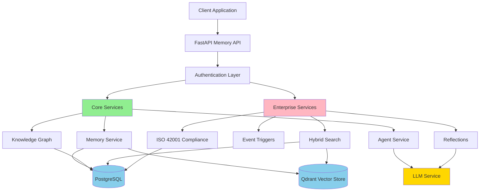

---

## Request Flow

### Memory Storage Flow

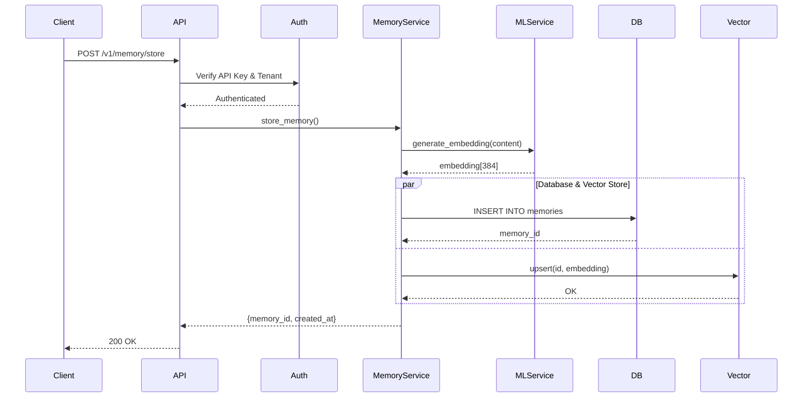

### Hybrid Search Flow

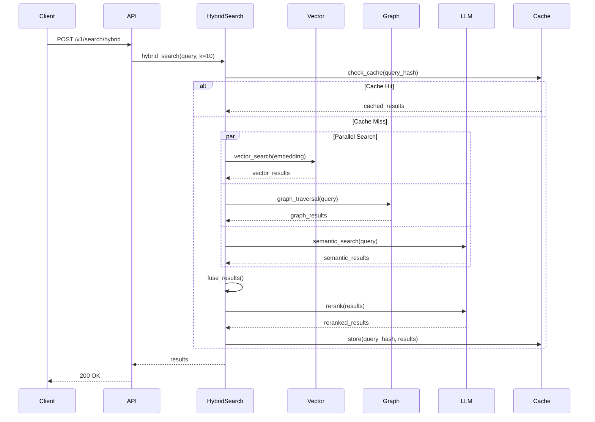

---

## Data Flow

### Memory Lifecycle

```mermaid
flowchart LR
    Input[Input Content] --> Validate{Validate}
    Validate -->|Invalid| Error[400 Error]
    Validate -->|Valid| Embed[Generate Embedding]

    Embed --> Store[Store in DB]
    Store --> Vector[Store in Vector DB]
    Vector --> Index[Add to Search Index]

    Index --> Episodic[Episodic Memory]
    Episodic --> |Time-based Decay| Semantic[Semantic Memory]
    Semantic --> |Reflection| LTM[Long-term Memory]

    LTM --> Archive[Archive/Retention]
    Archive -->|Retention Policy| Delete[Delete/GDPR]

    style Input fill:#90EE90
    style Episodic fill:#FFB6C1
    style Semantic fill:#87CEEB
    style LTM fill:#FFD700
    style Delete fill:#FF6B6B
```

### Event Trigger Flow

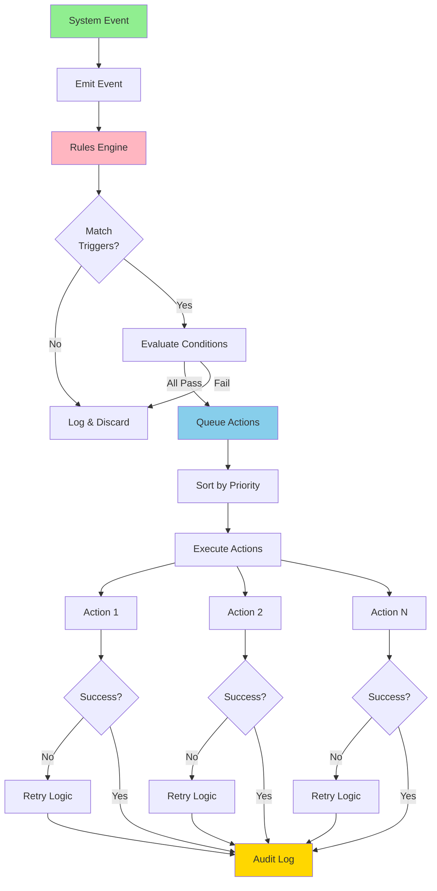

---

## Service Architecture

### 3-Layer Architecture

```mermaid
graph TB
    subgraph "API Layer"
        Routes[FastAPI Routes]
        Auth[Authentication]
        Validation[Request Validation]
    end

    subgraph "Service Layer"
        MemoryService[Memory Service]
        GraphService[Graph Service]
        SearchService[Hybrid Search Service]
        ComplianceService[Compliance Service]
        TriggerService[Trigger Service]
    end

    subgraph "Repository Layer"
        MemoryRepo[Memory Repository]
        GraphRepo[Graph Repository]
        TriggerRepo[Trigger Repository]
        MetricsRepo[Metrics Repository]
    end

    subgraph "Data Layer"
        Postgres[(PostgreSQL)]
        Qdrant[(Qdrant)]
        Redis[(Redis Cache)]
    end

    Routes --> Auth
    Auth --> Validation
    Validation --> MemoryService
    Validation --> GraphService
    Validation --> SearchService
    Validation --> ComplianceService
    Validation --> TriggerService

    MemoryService --> MemoryRepo
    GraphService --> GraphRepo
    TriggerService --> TriggerRepo
    SearchService --> MetricsRepo

    MemoryRepo --> Postgres
    GraphRepo --> Postgres
    TriggerRepo --> Postgres
    MetricsRepo --> Postgres

    MemoryService --> Qdrant
    SearchService --> Qdrant
    SearchService --> Redis

    style "API Layer" fill:#90EE90
    style "Service Layer" fill:#FFB6C1
    style "Repository Layer" fill:#87CEEB
    style "Data Layer" fill:#FFD700
```

### Microservices

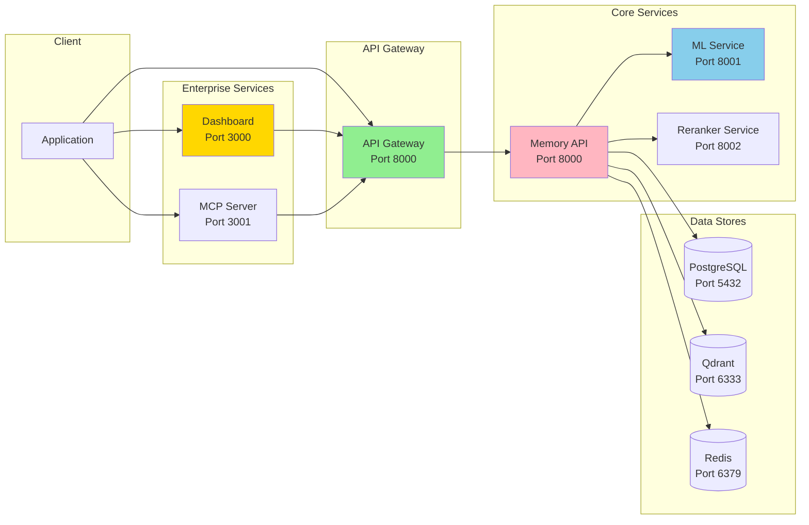

---

## Database Schema

### Core Tables

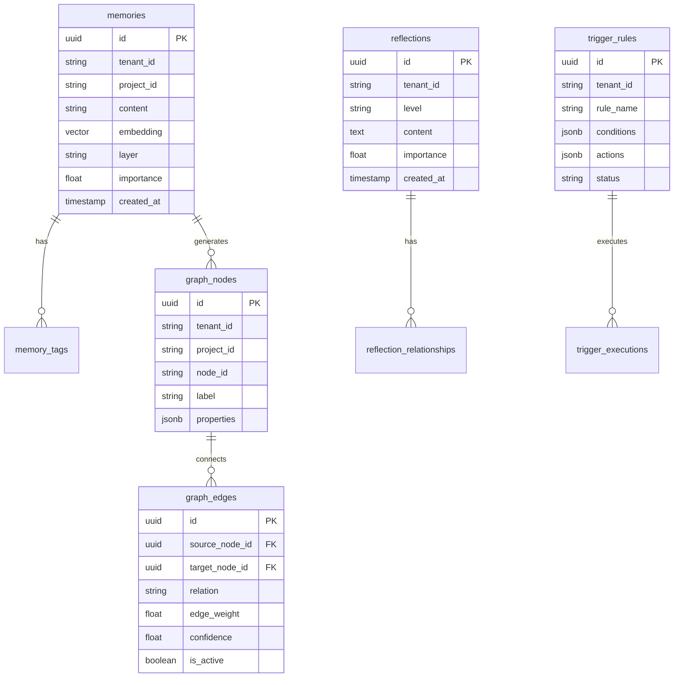

### Enterprise Tables

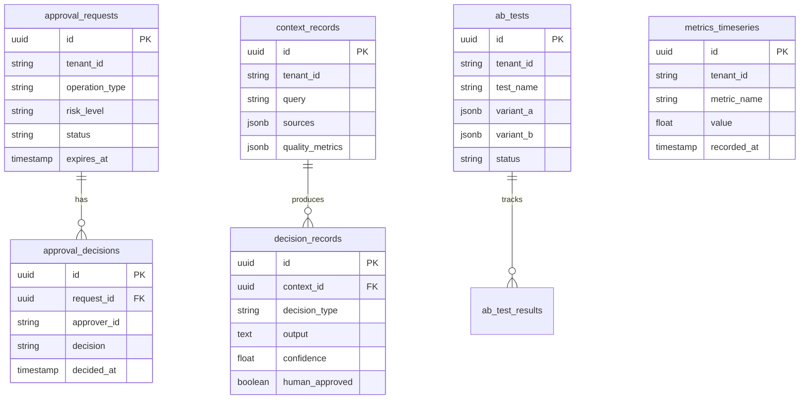

---

## Deployment Architecture

### Docker Compose

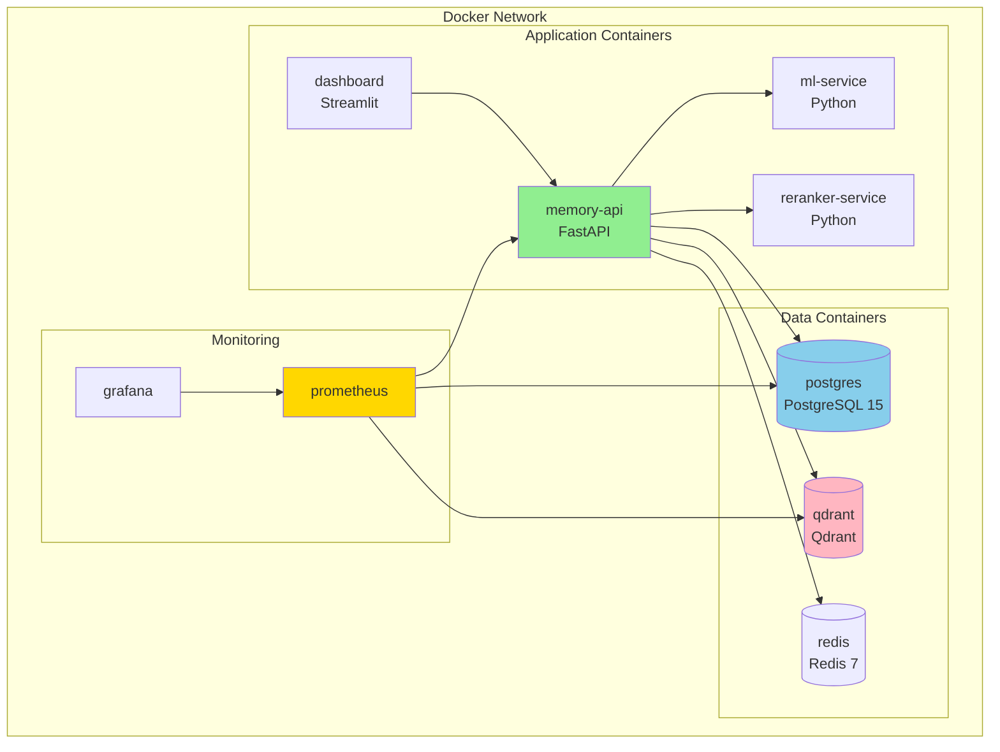

### Production Deployment

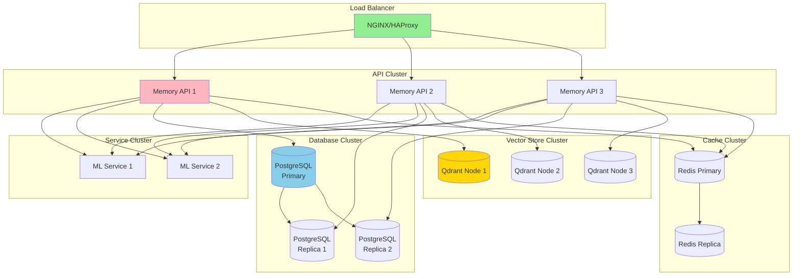

---

## Security Architecture

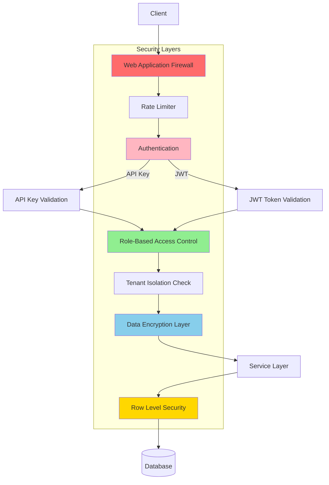

---

## Compliance Flow (ISO/IEC 42001)

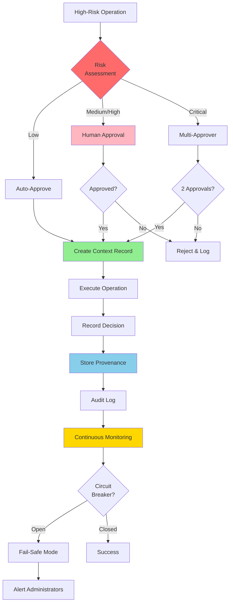

---

## Viewing These Diagrams

### GitHub/GitLab

Mermaid diagrams render automatically in Markdown files.

### VS Code

Install extension: **Markdown Preview Mermaid Support**

### Online Editors

- **Mermaid Live Editor**: https://mermaid.live/
- **Mermaid Chart**: https://www.mermaidchart.com/

### Export as Images

```bash
# Install mermaid-cli
npm install -g @mermaid-js/mermaid-cli

# Generate PNG
mmdc -i ARCHITECTURE_DIAGRAMS.md -o diagrams/

# Generate SVG
mmdc -i ARCHITECTURE_DIAGRAMS.md -o diagrams/ -t svg
```

---

## Further Reading

- [System Architecture](SYSTEM_ARCHITECTURE.md) - Detailed architecture documentation
- [API Reference](../api/api_reference.md) - API endpoints
- [Deployment Guide](../deployment/DEPLOYMENT_GUIDE.md) - Production deployment

---

**Last Updated**: 2025-12-04
**Version**: 2.2.0-enterprise
