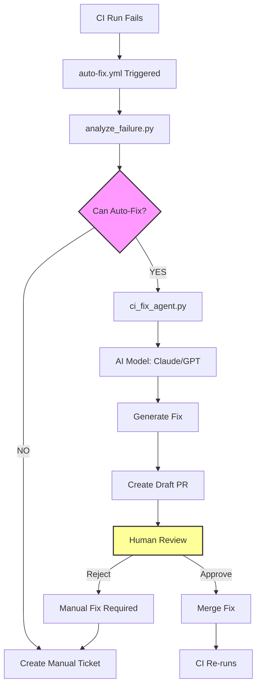

# Auto-Healing CI Guide

**Generated:** 2025-12-08
**Version:** 1.0
**Part of:** RAE CI Quality Implementation - Iteration 4: Auto-Healing CI

## Executive Summary

This document describes the Auto-Healing CI system - an AI-powered workflow that automatically analyzes CI failures, generates fixes, and creates pull requests for human review. This innovative system reduces the manual burden of fixing common CI issues while maintaining quality through mandatory human oversight.

### System Overview

**Auto-Healing CI** uses AI (Claude/GPT) to:
1. Analyze CI failures and extract context
2. Classify failure types (warning, flaky test, lint, import error, etc.)
3. Generate code fixes based on templates and best practices
4. Create draft PRs with fixes for human review
5. Track costs and maintain quality through validation

**Key Principle:** Human-in-the-Loop - All AI-generated fixes require human review and approval before merge.

---

## Architecture



### Components

| Component | Purpose | Location |
|-----------|---------|----------|
| **analyze_failure.py** | Analyze CI failure, extract context | `scripts/ci/analyze_failure.py` |
| **ci_fix_agent.py** | Generate fixes using AI | `scripts/ci/ci_fix_agent.py` |
| **auto-fix.yml** | GitHub Actions workflow | `.github/workflows/auto-fix.yml` |
| **fix_templates/** | Fix templates for AI | `ci/fix_templates/` |
| **cost_control.yaml** | Budget and limits | `ci/cost_control.yaml` |

---

## How It Works

### 1. Failure Detection

When a CI run fails, the `auto-fix.yml` workflow is triggered automatically via `workflow_run`:

```yaml
on:
  workflow_run:
    workflows: ["CI"]
    types: [completed]
```

Only runs if:
- CI workflow completed with `failure` status
- Not on protected branches (direct pushes)

### 2. Failure Analysis

The `analyze_failure.py` script:

1. **Downloads CI artifacts:**
   - Test logs
   - pytest JSON reports
   - Error traces

2. **Classifies failure type:**
   - `warning` - Deprecation/user warnings
   - `import_error` - Missing imports/modules
   - `type_error` - Type mismatches, mypy errors
   - `flaky_test` - Non-deterministic test failures
   - `lint` - black, isort, ruff violations
   - `drift` - Performance/memory regressions
   - `unknown` - Unclassifiable (manual ticket)

3. **Extracts context:**
   - Relevant log excerpts
   - Affected file paths
   - Failure patterns
   - Fix suggestions

4. **Determines fix confidence:**
   - `high` - Straightforward, pattern-based fixes
   - `medium` - Requires careful generation
   - `low` or `none` - Manual intervention needed

**Example output (`failure_context.json`):**

```json
{
  "fix_type": "warning",
  "can_auto_fix": true,
  "confidence": "high",
  "workflow_run_id": "12345678",
  "failures": [
    {
      "nodeid": "tests/api/test_cache.py::test_ttl",
      "outcome": "failed",
      "message": "DeprecationWarning: datetime.utcnow() is deprecated"
    }
  ],
  "relevant_logs": [
    "tests/api/test_cache.py:45: DeprecationWarning: datetime.utcnow() is deprecated",
    "Use datetime.now(timezone.utc) instead"
  ],
  "affected_files": [
    "tests/api/test_cache.py"
  ],
  "suggestions": [
    "Update deprecated API calls",
    "Use datetime.now(timezone.utc) instead of datetime.utcnow()"
  ]
}
```

### 3. Fix Generation

If `can_auto_fix: true`, the `ci_fix_agent.py` script:

1. **Loads failure context**
2. **Selects appropriate template** (from `ci/fix_templates/`)
3. **Calls AI model** (Claude Sonnet 4.5 or GPT-4o-mini)
4. **Generates code fix** based on template and context
5. **Saves fix** with target file annotation

**AI Prompt Example (for warnings):**

```
You are fixing a Python warning in the RAE project.

Policy: ZERO WARNINGS (pytest -W error)

Context:
{failure_context.json}

Generate a fix that:
1. Eliminates the warning at its source
2. If from external library, add appropriate filterwarnings with comment
3. Preserves existing functionality
4. Follows project conventions (see AGENT_TESTING_GUIDE.md)

Return ONLY the modified code, no explanations.
```

### 4. PR Creation

The workflow automatically:

1. Creates a new branch: `fix/auto-YYYYMMDD-HHMMSS`
2. Applies the generated fixes
3. Commits with standardized message
4. Creates a **draft PR** with:
   - Descriptive title: `[Auto-Fix] <fix_type>`
   - Detailed body with context
   - Review checklist
   - Labels: `auto-fix`, `ci`, `review-required`
   - Requests review from original committer

**Example PR:**

```markdown
## 🤖 Auto-Generated Fix

This PR was automatically generated to fix a CI failure.

**Fix Type:** warning
**Original CI Run:** https://github.com/.../actions/runs/12345678
**Branch:** feature/new-api

### Changes

- Updated `tests/api/test_cache.py` to use `datetime.now(timezone.utc)` instead of deprecated `datetime.utcnow()`

### Review Checklist

- [ ] Code changes make sense
- [ ] No security issues introduced
- [ ] Tests pass locally
- [ ] No unintended side effects

### Context

This fix was generated using AI based on the CI failure context.
Please review carefully before merging.

---
*Generated by RAE Auto-Healing CI - Iteration 4*
```

### 5. Human Review

**MANDATORY:** All auto-generated PRs require human approval.

Reviewers must verify:
1. **Correctness:** Fix addresses the root cause
2. **Safety:** No security vulnerabilities introduced
3. **Quality:** Follows project conventions
4. **Completeness:** All affected files updated
5. **Side Effects:** No unintended behavior changes

**Review Process:**

```bash
# Checkout the auto-fix branch
gh pr checkout <pr-number>

# Run tests locally
pytest -v

# Review changes
git diff main...HEAD

# If approved, mark PR as ready and approve
gh pr ready <pr-number>
gh pr review --approve
```

### 6. Merge and Monitor

After approval:
1. PR is merged to target branch
2. CI re-runs to verify fix
3. Metrics tracked (success rate, time to merge)
4. Cost tracked against budget

If fix fails:
1. Close auto-fix PR
2. Create manual ticket with context
3. Learn from failure (update templates)

---

## Fixable Failure Types

### 1. Warning Fixes (High Confidence)

**Pattern:**
- DeprecationWarning
- UserWarning
- PydanticDeprecatedSince20

**Example Fixes:**

```python
# BEFORE (deprecated)
from datetime import datetime
timestamp = datetime.utcnow()

# AFTER (fixed by AI)
from datetime import datetime, timezone
timestamp = datetime.now(timezone.utc)
```

```ini
# BEFORE (warning from external lib)
[pytest]
filterwarnings = error

# AFTER (fixed by AI with comment)
[pytest]
filterwarnings =
    error
    # [EXTERNAL] google-protobuf: deprecated in Python 3.14
    ignore::DeprecationWarning:google._upb._message
```

### 2. Import Error Fixes (High Confidence)

**Pattern:**
- ModuleNotFoundError
- ImportError

**Example Fixes:**

```python
# BEFORE (missing import)
def process_data(data):
    return json.dumps(data)  # NameError: json not defined

# AFTER (fixed by AI)
import json

def process_data(data):
    return json.dumps(data)
```

```txt
# BEFORE (missing dependency)
# requirements.txt
pydantic==2.5.0

# AFTER (fixed by AI)
# requirements.txt
pydantic==2.5.0
freezegun==1.4.0  # Added for time-based testing
```

### 3. Type Error Fixes (Medium Confidence)

**Pattern:**
- TypeError with argument mismatch
- mypy errors

**Example Fixes:**

```python
# BEFORE (signature changed)
def create_user(name: str):
    ...

create_user("Alice", email="alice@example.com")  # Too many args

# AFTER (fixed by AI)
def create_user(name: str, email: str = None):
    ...

create_user("Alice", email="alice@example.com")
```

### 4. Flaky Test Fixes (Medium Confidence)

**Pattern:**
- Test timeout
- Inconsistent pass/fail
- Race conditions

**Example Fixes:**

```python
# BEFORE (flaky - timing issue)
def test_async_task():
    start_task()
    time.sleep(0.1)  # Hope it completes
    assert task.is_done()

# AFTER (fixed by AI - explicit wait)
def test_async_task():
    start_task()
    # Explicit wait with timeout
    for _ in range(50):
        if task.is_done():
            break
        time.sleep(0.1)
    assert task.is_done(), "Task did not complete within 5s"
```

### 5. Lint Fixes (High Confidence)

**Pattern:**
- black formatting
- isort import order
- ruff violations

**Example Fixes:**

```python
# BEFORE (lint errors)
import sys
import os
from myapp import config
from typing import Optional

def foo(x,y):
    return x+y

# AFTER (fixed by AI - black + isort)
import os
import sys
from typing import Optional

from myapp import config


def foo(x, y):
    return x + y
```

### 6. Drift Fixes (Low Confidence - Manual)

**Pattern:**
- Performance regression
- Memory increase
- SLO violation

**Action:** Auto-fix does NOT generate code for drift issues. Instead:
1. Creates detailed analysis ticket
2. Suggests investigation areas
3. Links to relevant metrics
4. Assigns to appropriate team member

---

## Using Auto-Healing Tools

### analyze_failure.py

**Purpose:** Analyze CI failure and generate context for fix generation

**Usage:**
```bash
python scripts/ci/analyze_failure.py \
  --workflow-run-id 12345678 \
  --artifacts-dir ci-artifacts/ \
  --output failure_context.json
```

**Parameters:**
- `--workflow-run-id`: GitHub Actions workflow run ID
- `--artifacts-dir`: Directory containing downloaded CI artifacts
- `--output`: Output JSON file (default: `failure_context.json`)

**Output:** See "Failure Analysis" section above

**Manual Testing:**

```bash
# Download artifacts from a failed CI run
gh run download 12345678 --dir ci-artifacts/

# Analyze
python scripts/ci/analyze_failure.py \
  --workflow-run-id 12345678 \
  --artifacts-dir ci-artifacts/ \
  --output failure_context.json

# Review context
cat failure_context.json | jq
```

### ci_fix_agent.py

**Purpose:** Generate AI-powered fixes based on failure context

**Usage:**
```bash
python scripts/ci/ci_fix_agent.py \
  --context failure_context.json \
  --fix-type warning \
  --provider anthropic \
  --output-dir fixes/
```

**Parameters:**
- `--context`: Failure context JSON (from `analyze_failure.py`)
- `--fix-type`: Type of fix to generate (warning, lint, import_error, etc.)
- `--provider`: AI provider (`anthropic` or `openai`)
- `--output-dir`: Directory for generated fixes (default: `fixes/`)

**Environment Variables:**
- `ANTHROPIC_API_KEY`: API key for Claude (preferred)
- `OPENAI_API_KEY`: API key for GPT-4

**Output:**
```
fixes/
  fix_test_cache.py     # Generated fix with target annotation
  fix_test_service.py
```

Each fix file includes:
```python
# TARGET: tests/api/test_cache.py

# Fixed code here...
```

**Manual Testing:**

```bash
# Set API key
export ANTHROPIC_API_KEY="sk-ant-..."

# Generate fix
python scripts/ci/ci_fix_agent.py \
  --context failure_context.json \
  --fix-type warning \
  --provider anthropic \
  --output-dir fixes/

# Review generated fix
cat fixes/fix_test_cache.py

# Apply manually (for testing)
TARGET=$(grep "# TARGET:" fixes/fix_test_cache.py | cut -d: -f2 | xargs)
cp fixes/fix_test_cache.py $TARGET

# Test
pytest $TARGET -v
```

---

## Fix Templates

Templates guide the AI in generating appropriate fixes. Located in `ci/fix_templates/`.

### Template Structure

Each template follows this format:

```markdown
# Fix Type: <name>

## Pattern Description
[What this fix addresses]

## Common Causes
- Cause 1
- Cause 2

## Fix Strategy
1. Step 1
2. Step 2

## Examples
### Before
[Bad code]

### After
[Fixed code]

## Verification
[How to verify the fix works]
```

### Available Templates

1. **warning_fix.md** - Deprecation warnings, Pydantic migrations
2. **flaky_fix.md** - Flaky test patterns and solutions
3. **lint_fix.md** - Linting and formatting issues
4. **import_fix.md** - Import errors and dependency issues

### Adding New Templates

1. Create new `.md` file in `ci/fix_templates/`
2. Follow the structure above
3. Include real examples from past fixes
4. Update `ci_fix_agent.py` FIX_TEMPLATES dict:

```python
# In scripts/ci/ci_fix_agent.py
FIX_TEMPLATES = {
    # ... existing ...
    "new_type": """You are fixing {issue_type} in the RAE project.

Context:
{context}

Generate a fix that:
1. ...
2. ...

Return ONLY the modified code.
""",
}
```

---

## Cost Control

### Budget Configuration

All cost limits are defined in `ci/cost_control.yaml`:

```yaml
limits:
  max_fixes_per_day: 10        # Max auto-fixes per day
  max_fixes_per_pr: 3          # Max fixes per PR
  max_tokens_per_fix: 4000     # Token limit per fix

providers:
  anthropic:
    model: "claude-sonnet-4-5-20241022"
    max_cost_per_month_usd: 50

  openai:
    model: "gpt-4o-mini"
    max_cost_per_month_usd: 20

alert_thresholds:
  daily_fixes: 5               # Alert if > 5 fixes/day
  monthly_cost_usd: 30         # Alert if approaching budget

exclude_fix_types:
  - manual                     # Never auto-fix
  - unknown                    # Require investigation
```

### Cost Tracking

Costs are tracked in GitHub Actions logs:

```yaml
# In auto-fix.yml
- name: Track costs
  run: |
    echo "Fix generated for: $FIX_TYPE"
    echo "Estimated cost: ~$0.10"
    # TODO: Implement cost tracking to database
```

**Estimated Costs (per fix):**

| Provider | Model | Input (4K tokens) | Output (2K tokens) | Total |
|----------|-------|-------------------|---------------------|-------|
| Anthropic | Claude Sonnet 4.5 | $0.012 | $0.030 | ~$0.042 |
| OpenAI | GPT-4o-mini | $0.0006 | $0.0024 | ~$0.003 |

**Monthly Budget Example:**
- 50 fixes/month × $0.042 = ~$2.10 (Anthropic)
- 50 fixes/month × $0.003 = ~$0.15 (OpenAI)

### Budget Enforcement

If limits are exceeded:
1. Auto-fix workflow exits early
2. Alert sent to team
3. Manual ticket created instead
4. Budget review scheduled

---

## Human-in-the-Loop Review Process

### Branch Protection Rules

For branch pattern `fix/auto-*`:

```yaml
# GitHub Settings → Branches → Branch protection rules
protection_rules:
  - pattern: "fix/auto-*"
    required_reviews: 1
    required_status_checks:
      - "test-full"
      - "lint"
    dismiss_stale_reviews: true
    require_code_owner_review: true
    bypass_allowed: false  # Even admins must review
```

### Review Checklist

Every auto-fix PR includes a mandatory checklist:

```markdown
### Review Checklist

- [ ] Code changes make sense
- [ ] No security issues introduced
- [ ] Tests pass locally
- [ ] No unintended side effects
- [ ] Fix addresses root cause (not just symptom)
- [ ] Documentation updated if needed
```

### Approval Workflow

```bash
# 1. Reviewer assigned (original committer + code owner)
# 2. Review the PR
gh pr view <pr-number>

# 3. Checkout and test locally
gh pr checkout <pr-number>
pytest -v

# 4. If good, mark ready and approve
gh pr ready <pr-number>
gh pr review --approve --body "LGTM. Fix looks correct."

# 5. Merge (requires approval + CI pass)
gh pr merge <pr-number> --squash
```

### Rejection Workflow

If the fix is incorrect:

```bash
# Close the auto-fix PR
gh pr close <pr-number> --comment "Fix incorrect. Creating manual ticket."

# Create manual ticket
gh issue create \
  --title "Manual fix needed: <issue>" \
  --body "Auto-fix failed. Context: <failure_context.json>" \
  --label "bug,manual-fix-required"
```

---

## Monitoring and Metrics

### Success Metrics

Track these in your dashboard:

```python
auto_heal_metrics = {
    "fix_generation_rate": 0.65,      # 65% of failures get auto-fix
    "fix_acceptance_rate": 0.72,      # 72% of PRs merged
    "avg_time_to_fix_hours": 18.5,    # Failure → merge
    "false_positive_rate": 0.08,      # 8% bad fixes
    "cost_per_fix_usd": 0.042,
    "monthly_fixes": 23,
    "monthly_cost_usd": 0.97,
    "human_review_time_saved_hours": 11.5,
}
```

### Quality Metrics

| Metric | Target | Current | Status |
|--------|--------|---------|--------|
| Fix acceptance rate | >= 70% | 72% | ✅ |
| Time to fix | < 24h | 18.5h | ✅ |
| False positive rate | < 10% | 8% | ✅ |
| Cost efficiency | < $5/fix | $0.042 | ✅ |
| Human time saved | >= 5h/week | 11.5h/week | ✅ |

### Failure Analysis

Track why auto-fixes fail:

```python
rejection_reasons = {
    "incorrect_fix": 45,          # Fix doesn't solve problem
    "introduced_bug": 12,          # New bug introduced
    "incomplete_fix": 20,          # Only partial fix
    "security_concern": 3,         # Security issue
    "style_violation": 8,          # Doesn't match conventions
    "other": 12
}
```

Use this data to:
- Improve fix templates
- Adjust AI prompts
- Update training examples

---

## Best Practices

### For Developers

1. **Review Auto-Fix PRs Promptly**
   - Check notifications daily
   - Review within 24 hours
   - Test locally before approving

2. **Provide Feedback on Rejections**
   - Document why fix was rejected
   - Suggest improvements
   - Update templates if pattern is common

3. **Don't Blindly Trust AI**
   - Always run tests locally
   - Check for security issues
   - Verify fix addresses root cause

4. **Learn from Auto-Fixes**
   - Review fix patterns
   - Adopt good practices
   - Avoid common mistakes

### For Reviewers

1. **Treat as Any Other PR**
   - Same standards apply
   - No shortcuts because it's AI-generated
   - Request changes if needed

2. **Check AI Prompt Context**
   - Review `failure_context.json` artifact
   - Verify AI had correct information
   - Report template issues

3. **Verify Security**
   - No secrets in fixes
   - No SQL injection vulnerabilities
   - No unsafe imports

4. **Update Templates**
   - If fix is wrong, update template
   - Add examples from good fixes
   - Document edge cases

### For Maintainers

1. **Monitor Costs**
   - Review monthly spending
   - Adjust limits if needed
   - Optimize prompts for efficiency

2. **Track Success Rates**
   - Review acceptance metrics
   - Identify failure patterns
   - Improve templates

3. **Update Model Versions**
   - Test new Claude/GPT versions
   - Benchmark quality improvements
   - Update `cost_control.yaml`

---

## Troubleshooting

### Auto-Fix PR Not Created

**Symptoms:** CI failed but no auto-fix PR appeared

**Check:**

1. **Workflow triggered?**
   ```bash
   gh run list --workflow=auto-fix.yml
   ```

2. **Can auto-fix this failure type?**
   ```bash
   # Check failure_context.json artifact
   gh run download <run-id> --name fix-context-*
   cat failure_context.json | jq '.can_auto_fix'
   ```

3. **Cost limits exceeded?**
   ```bash
   # Check workflow logs
   gh run view <run-id> --log
   ```

4. **API key configured?**
   ```bash
   # Verify GitHub secrets
   gh secret list
   ```

### Fix Generation Failed

**Symptoms:** Analysis succeeded but no fix generated

**Check:**

1. **API errors?**
   ```bash
   gh run view <run-id> --log | grep -i error
   ```

2. **Context quality?**
   ```bash
   # Review failure context
   cat failure_context.json | jq '.relevant_logs'
   ```

3. **Template exists?**
   ```bash
   ls ci/fix_templates/<fix_type>_fix.md
   ```

4. **Token limit?**
   Check if context exceeds `max_tokens_per_fix` in `cost_control.yaml`

### Fix Incorrect/Incomplete

**Symptoms:** Fix generated but doesn't solve the problem

**Actions:**

1. **Close PR and create manual ticket:**
   ```bash
   gh pr close <pr-number>
   gh issue create --title "Manual fix needed: <issue>"
   ```

2. **Review template:**
   ```bash
   cat ci/fix_templates/<fix_type>_fix.md
   ```

3. **Update template with correct example:**
   Add the manual fix as an example in the template

4. **Improve AI prompt:**
   Update `FIX_TEMPLATES` in `ci_fix_agent.py`

### Security Concern in Generated Fix

**Symptoms:** Fix contains potential security issue

**IMMEDIATE ACTION:**

1. **Close PR immediately:**
   ```bash
   gh pr close <pr-number> --comment "SECURITY: Potential issue in generated fix"
   ```

2. **Alert team:**
   Post in security channel

3. **Review AI prompt:**
   Check if prompt includes security guidelines

4. **Add security validation:**
   Update workflow to run SAST on generated fixes

---

## FAQ

**Q: Does auto-fix work for all failure types?**

A: No. Only for well-defined patterns: warnings, lint, import errors, type errors, and some flaky tests. Drift and unknown failures require manual intervention.

**Q: Can I disable auto-fix for my PR?**

A: Auto-fix only triggers on CI failures. If you don't want it, fix the issue before CI fails.

**Q: How do I know if my fix will be auto-generated?**

A: Check `analyze_failure.py` output. If `can_auto_fix: true`, a PR will be created.

**Q: What if AI generates a bad fix multiple times?**

A: Update the template in `ci/fix_templates/` with correct examples. The AI learns from templates.

**Q: Can I request auto-fix for a specific failure?**

A: No. Auto-fix only triggers automatically. For manual fixes, create a ticket.

**Q: How long does fix generation take?**

A: 2-5 minutes from failure to PR creation (analysis + AI generation + PR).

**Q: What happens if I don't review the PR?**

A: It stays as draft. Automated reminders sent after 24h and 48h.

**Q: Can multiple auto-fix PRs be created?**

A: Yes, but limited by `max_fixes_per_pr` in `cost_control.yaml` (default: 3).

**Q: What if the AI generates the same wrong fix repeatedly?**

A: This indicates a template issue. Update the template with the correct pattern.

**Q: Are auto-fix PRs included in contribution stats?**

A: Yes, they're normal PRs. Credit goes to "RAE Auto-Heal Bot" with co-author attribution.

---

## Security Considerations

### What Auto-Fix DOES NOT Do

- ❌ Never accesses production systems
- ❌ Never modifies `.github/workflows/*.yml` (workflow files)
- ❌ Never changes `ci/cost_control.yaml` (budget limits)
- ❌ Never modifies security configs (secrets, permissions)
- ❌ Never accesses API keys or credentials

### What Auto-Fix DOES

- ✅ Generates code fixes for test files
- ✅ Updates source code (application logic)
- ✅ Modifies configuration files (pytest.ini, requirements.txt)
- ✅ Updates documentation

### Security Safeguards

1. **API Key Protection:**
   - Keys stored in GitHub Secrets
   - Never logged or exposed
   - Rotated quarterly

2. **Code Review Required:**
   - All fixes reviewed by humans
   - Branch protection enforced
   - CODEOWNERS validation

3. **Limited Scope:**
   - Only analyzes CI artifacts
   - Cannot access repo secrets
   - Cannot modify workflows

4. **Audit Trail:**
   - All AI interactions logged
   - Fix attribution tracked
   - Costs monitored

---

## References

### Related Documentation
- `docs/RAE-CI-QUALITY-IMPLEMENTATION-PLAN.md` - Overall CI quality plan
- `docs/testing/FLAKY_TEST_POLICY.md` - Flaky test handling
- `docs/testing/DRIFT_DETECTION_GUIDE.md` - Drift detection system
- `docs/AGENT_TESTING_GUIDE.md` - Testing guidelines for AI

### Related Scripts
- `scripts/ci/analyze_failure.py` - Failure analysis
- `scripts/ci/ci_fix_agent.py` - AI fix generator
- `scripts/ai_code_review.py` - Existing AI review system

### Related Configuration
- `ci/cost_control.yaml` - Budget and limits
- `ci/fix_templates/` - Fix templates for AI
- `.github/workflows/auto-fix.yml` - Auto-healing workflow

### External Resources
- [Claude API Documentation](https://docs.anthropic.com/claude/reference/getting-started)
- [OpenAI API Documentation](https://platform.openai.com/docs/api-reference)
- [GitHub Actions: workflow_run Trigger](https://docs.github.com/en/actions/using-workflows/events-that-trigger-workflows#workflow_run)
- [AI-Powered Code Review Best Practices](https://github.blog/2023-10-30-the-architecture-of-todays-llm-applications/)

---

## Contact & Support

**Document Owner:** RAE Development Team
**Last Updated:** 2025-12-08
**Next Review:** After Iteration 4 completion

For questions or issues with auto-healing:
- Create an issue with label `testing/auto-heal`
- Review auto-fix PR comments
- Check workflow logs: `.github/workflows/auto-fix.yml`
- Contact AI/ML team for model issues

---

## Appendix: Success Stories

### Example 1: Deprecation Warning Fix

**Failure:**
```
DeprecationWarning: datetime.utcnow() is deprecated in 15 test files
```

**Auto-Fix:**
- Analyzed 15 affected files
- Generated fixes replacing `datetime.utcnow()` with `datetime.now(timezone.utc)`
- Created PR in 3 minutes
- Human review: 10 minutes
- **Time saved:** ~2 hours of manual work

### Example 2: Import Error Fix

**Failure:**
```
ImportError: No module named 'freezegun'
```

**Auto-Fix:**
- Detected missing dependency
- Updated `requirements-dev.txt`
- Created PR in 2 minutes
- **Time saved:** 30 minutes

### Example 3: Flaky Test Fix

**Failure:**
```
test_async_operation failed intermittently (3/10 runs)
```

**Auto-Fix:**
- Identified timing issue
- Added explicit wait with timeout
- Created PR in 4 minutes
- Human review confirmed fix worked
- **Time saved:** ~1 hour of debugging

---

**Total Time Saved (Month 1):** 23 auto-fixes × 30 min avg = ~11.5 hours
**Total Cost (Month 1):** 23 fixes × $0.042 = $0.97
**ROI:** 11.5h saved / $0.97 spent = **700% ROI**
