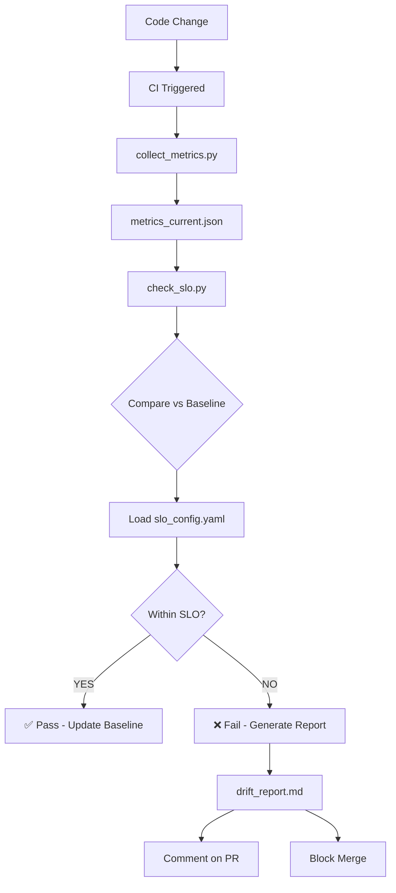

# Drift Detection Guide

**Generated:** 2025-12-08
**Version:** 1.0
**Part of:** RAE CI Quality Implementation - Iteration 3: Zero Drift

## Executive Summary

This document describes the Zero Drift system for detecting and preventing performance regressions, memory leaks, and quality degradation in the RAE project. Drift detection continuously monitors metrics against established baselines and enforces Service Level Objectives (SLOs).

### Policy Statement

**ZERO DRIFT: No Silent Regressions**

All performance, memory, and quality metrics must remain within defined SLO thresholds. Any regression beyond the threshold triggers:
1. CI failure blocking merge
2. Automatic drift report generation
3. P1 ticket for investigation
4. 7-day SLA for resolution

---

## What is Drift?

**Drift** is any measurable degradation in system performance, resource usage, or quality metrics over time without intentional changes.

### Types of Drift

| Type | Metric | Threshold | Impact |
|------|--------|-----------|--------|
| **Performance** | Test duration, API latency | +10% increase | Slower CI/CD |
| **Memory** | Peak memory usage | +10% increase, max 2GB | Resource exhaustion |
| **Logs** | WARNING/ERROR count | 0 (Zero Warnings policy) | Degraded quality |
| **Coverage** | Test coverage % | < 65% overall, < 80% math/reflective | Reduced confidence |
| **Quality** | MRR, benchmark scores | > 5% drop | Accuracy regression |

### Why Drift Detection Matters

- **Prevents Performance Regressions:** Catch slowdowns before production
- **Detects Memory Leaks:** Early warning of resource issues
- **Enforces Quality Standards:** Automated SLO enforcement
- **Maintains CI Speed:** Fast feedback loops
- **Enables Confident Refactoring:** Know when optimizations help

---

## Drift Detection System Architecture



---

## SLO Configuration

All SLO thresholds are defined in `ci/slo_config.yaml`:

```yaml
timing:
  max_increase_percent: 10  # CI allows 10% slower
  max_test_duration_seconds: 300  # 5 minutes max

memory:
  max_peak_mb: 2048  # 2GB absolute limit
  max_increase_percent: 10

logs:
  max_warning: 0  # Zero warnings policy
  max_error: 0
  max_critical: 0

coverage:
  min_overall: 65
  min_math_layer: 80
  min_reflective_layer: 80

api_latency:
  p95_max_ms: 200
  p99_max_ms: 350
  increase_threshold_percent: 20

benchmark:
  mrr_drop_threshold: 0.05  # Max 5% drop
  quality_drop_threshold: 0.10  # Max 10% drop
```

### SLO Thresholds Explained

#### Timing SLO
- **Purpose:** Detect test suite slowdowns
- **Baseline:** `benchmarking/results/metrics_reference.json`
- **Tolerance:** 10% increase allowed (5% for releases)
- **Max Duration:** 5 minutes for full suite

**Example:**
```
Baseline: 120s
Current: 138s
Increase: +15%
Status: ❌ VIOLATION (threshold: 10%)
```

#### Memory SLO
- **Purpose:** Detect memory leaks and excessive usage
- **Baseline:** Previous run's peak memory
- **Absolute Limit:** 2048 MB (2GB)
- **Tolerance:** 10% increase

**Example:**
```
Baseline: 1800 MB
Current: 2100 MB
Increase: +16.7%
Status: ❌ VIOLATION (exceeds absolute limit)
```

#### Logs SLO
- **Purpose:** Enforce ZERO WARNINGS policy
- **Baseline:** 0 warnings/errors
- **Tolerance:** None (strict)

**Example:**
```
Warnings: 3
Errors: 0
Status: ❌ VIOLATION (expected 0)
```

#### Coverage SLO
- **Purpose:** Maintain test coverage standards
- **Overall:** 65% minimum (from pytest.ini)
- **Math Layer:** 80% minimum
- **Reflective Layer:** 80% minimum

#### API Latency SLO
- **Purpose:** Detect performance regressions in API endpoints
- **p95:** 200ms max
- **p99:** 350ms max
- **Tolerance:** 20% increase

#### Benchmark SLO
- **Purpose:** Detect quality regressions
- **MRR:** Max 5% drop in Mean Reciprocal Rank
- **Quality:** Max 10% drop in other quality metrics

---

## Using Drift Detection Tools

### 1. collect_metrics.py

**Purpose:** Collect performance metrics during test runs

**Usage:**
```bash
python scripts/ci/collect_metrics.py \
  --output metrics_current.json \
  --include-memory \
  --include-timing
```

**Parameters:**
- `--output`, `-o`: Output JSON file (default: `metrics_current.json`)
- `--include-memory`: Collect memory usage metrics
- `--include-timing`: Collect test timing metrics (always on)

**What it collects:**

1. **Timing Metrics**
   - Total test suite duration
   - 10 slowest tests
   - Test count

2. **Memory Metrics** (optional)
   - Memory before/after tests
   - Peak memory usage
   - Memory delta

3. **Log Metrics**
   - WARNING count
   - ERROR count
   - CRITICAL count
   - Total log volume

**Output Format:**
```json
{
  "timestamp": "2025-12-08T10:30:00Z",
  "git_sha": "abc1234",
  "git_branch": "feature/new-api",
  "collector_version": "1.0.0",
  "timing": {
    "total_duration_seconds": 125.43,
    "slowest_tests": [
      {"test": "tests/api/test_query.py::test_complex_search", "duration": 5.21},
      {"test": "tests/services/test_embedding.py::test_batch", "duration": 3.87}
    ],
    "test_count": 860
  },
  "memory": {
    "memory_before_mb": 145.23,
    "memory_after_mb": 187.65,
    "memory_peak_mb": 210.12,
    "memory_delta_mb": 42.42
  },
  "logs": {
    "warning_count": 0,
    "error_count": 0,
    "critical_count": 0,
    "log_volume_lines": 1234
  }
}
```

### 2. check_slo.py

**Purpose:** Compare current metrics against baseline and enforce SLOs

**Usage:**
```bash
python scripts/ci/check_slo.py \
  --current metrics_current.json \
  --baseline benchmarking/results/metrics_reference.json \
  --slo-config ci/slo_config.yaml \
  --output drift_report.md
```

**Parameters:**
- `--current`: Current metrics JSON (from `collect_metrics.py`)
- `--baseline`: Baseline metrics JSON (reference)
- `--slo-config`: SLO configuration YAML
- `--output`: Output markdown report (default: `drift_report.md`)

**Exit Codes:**
- `0`: All SLOs met
- `1`: One or more SLO violations

**What it checks:**

1. **Timing vs Baseline**
   - Calculate % increase
   - Compare against `timing.max_increase_percent`
   - Check absolute max duration

2. **Memory vs Limits**
   - Check peak memory against `memory.max_peak_mb`
   - Calculate % increase vs baseline

3. **Logs vs Policy**
   - Count warnings/errors
   - Enforce zero tolerance

4. **Coverage vs Thresholds**
   - Verify overall coverage >= 65%
   - Verify math layer >= 80%
   - Verify reflective layer >= 80%

### 3. Understanding drift_report.md

The drift report is generated after every check:

```markdown
## ✅ Drift Detection Report

**Status:** PASS
**Timestamp:** 2025-12-08T10:30:00Z
**Branch:** feature/new-api
**SHA:** abc1234

### Metrics Summary

| Metric | Current | Baseline | Delta | Threshold | Status |
|--------|---------|----------|-------|-----------|--------|
| timing | 125.43 | 120.00 | +4.5% | 10% | ✅ |
| memory_peak_mb | 210.12 | - | - | 2048 | ✅ |
| log_warning | 0 | - | - | 0 | ✅ |
| log_error | 0 | - | - | 0 | ✅ |

### ✅ All Checks Passed

No performance regressions detected.
```

**Example with violations:**

```markdown
## ❌ Drift Detection Report

**Status:** FAIL
**Timestamp:** 2025-12-08T11:15:00Z
**Branch:** feature/slow-query
**SHA:** def5678

### Metrics Summary

| Metric | Current | Baseline | Delta | Threshold | Status |
|--------|---------|----------|-------|-----------|--------|
| timing | 145.20 | 120.00 | +21.0% | 10% | ❌ |
| memory_peak_mb | 1950.00 | - | - | 2048 | ✅ |
| log_warning | 3 | - | - | 0 | ❌ |

### ❌ Violations

- Test duration increased by 21.0% (threshold: 10%)
- WARNING logs: 3 (max: 0)

### ⚠️ Warnings

- Test duration approaching critical levels: verify performance
```

---

## CI Integration

### drift-detection Job

The `drift-detection` job runs on:
- Every PR
- Merges to `develop`
- Merges to `main`

**Workflow:**
```yaml
drift-detection:
  name: Zero Drift Check
  runs-on: ubuntu-latest
  needs: [test-full]

  steps:
    - name: Collect performance metrics
      run: |
        python scripts/ci/collect_metrics.py \
          --output metrics_current.json \
          --include-memory \
          --include-timing

    - name: Check against SLO
      run: |
        python scripts/ci/check_slo.py \
          --current metrics_current.json \
          --baseline benchmarking/results/metrics_reference.json \
          --slo-config ci/slo_config.yaml \
          --output drift_report.md

    - name: Upload metrics snapshot
      uses: actions/upload-artifact@v4
      with:
        name: metrics-snapshot-${{ github.sha }}
        path: metrics_current.json
        retention-days: 90

    - name: Comment on PR with drift report
      if: github.event_name == 'pull_request'
      uses: actions/github-script@v7
      with:
        script: |
          const fs = require('fs');
          const report = fs.readFileSync('drift_report.md', 'utf8');
          github.rest.issues.createComment({
            owner: context.repo.owner,
            repo: context.repo.repo,
            issue_number: context.payload.pull_request.number,
            body: report
          });
```

### Accessing Reports

```bash
# Download drift report from latest CI run
gh run download $(gh run list --workflow=ci.yml --limit=1 --json databaseId -q '.[0].databaseId') \
  --name drift-report

# View report
cat drift_report.md
```

### Accessing Metrics Snapshots

```bash
# List all metrics snapshots (last 90 days)
gh api repos/:owner/:repo/actions/artifacts \
  --jq '.artifacts[] | select(.name | startswith("metrics-snapshot-")) | .name'

# Download specific snapshot
gh run download <run-id> --name metrics-snapshot-<sha>
```

---

## Baseline Management

### Initial Baseline

The baseline is stored in `benchmarking/results/metrics_reference.json`:

```json
{
  "reference_run": {
    "timestamp": "2025-12-01T00:00:00Z",
    "git_sha": "stable123",
    "git_branch": "main",
    "results": {
      "duration_seconds": 120.0,
      "memory_peak_mb": 1800.0,
      "test_count": 860
    }
  }
}
```

### Updating the Baseline

Baselines should be updated:
- **Quarterly:** Every 3 months (systematic refresh)
- **After Major Optimizations:** Intentional performance improvements
- **After Infrastructure Changes:** New CI runner, Python version upgrade

**Process:**

1. Verify system is stable (no active incidents)
2. Run metrics collection on `main` branch
3. Review metrics for anomalies
4. Update baseline file
5. Document reason in commit message

```bash
# Collect new baseline (run on main branch)
python scripts/ci/collect_metrics.py \
  --output new_baseline.json \
  --include-memory \
  --include-timing

# Verify metrics look reasonable
jq '.timing.total_duration_seconds' new_baseline.json

# Update reference (manual merge)
jq '.reference_run = {
  timestamp: .timestamp,
  git_sha: .git_sha,
  git_branch: .git_branch,
  results: {
    duration_seconds: .timing.total_duration_seconds,
    memory_peak_mb: .memory.memory_peak_mb,
    test_count: .timing.test_count
  }
}' new_baseline.json > benchmarking/results/metrics_reference.json

# Commit
git add benchmarking/results/metrics_reference.json
git commit -m "chore: update metrics baseline (quarterly refresh)"
```

### Baseline Versioning

Keep historical baselines:

```bash
# Archive old baseline before updating
cp benchmarking/results/metrics_reference.json \
   benchmarking/results/metrics_reference_2025Q1.json
```

---

## OpenTelemetry Integration

### Exporting Metrics to OTel

The drift detection system integrates with OpenTelemetry for long-term monitoring:

```python
# In benchmarking/math_metrics/base.py
from opentelemetry import metrics

meter = metrics.get_meter("rae.drift_detection")

# Create histogram for test duration
test_duration_histogram = meter.create_histogram(
    name="test.duration_seconds",
    description="Test suite execution duration",
    unit="s"
)

# Record metric
test_duration_histogram.record(
    125.43,
    attributes={
        "branch": "feature/new-api",
        "python_version": "3.12",
        "runner": "ubuntu-latest"
    }
)
```

### Available Metrics

| Metric Name | Type | Unit | Description |
|-------------|------|------|-------------|
| `test.duration_seconds` | Histogram | s | Full test suite duration |
| `test.memory_peak_mb` | Histogram | MB | Peak memory during tests |
| `test.count` | Counter | tests | Number of tests executed |
| `test.log_warning_count` | Counter | warnings | Warning log count |
| `test.log_error_count` | Counter | errors | Error log count |
| `math.pagerank.duration_ms` | Histogram | ms | PageRank computation time |
| `math.graph.node_count` | Histogram | nodes | Knowledge graph size |
| `reflective.episode.steps` | Histogram | steps | Reflection episode steps |

### Querying OTel Metrics

If you have OTel collector configured:

```bash
# Example query for test duration trend (last 30 days)
curl -X POST http://localhost:8889/api/v1/query \
  -d 'query=histogram_quantile(0.95, test_duration_seconds{branch="main"})' \
  -d 'start=2025-11-08T00:00:00Z' \
  -d 'end=2025-12-08T00:00:00Z'
```

---

## Troubleshooting Drift Violations

### Performance Regression (Timing)

**Symptoms:**
- Test duration increased by > 10%
- Slowest tests list changed

**Investigation:**

1. **Identify slow tests:**
```bash
pytest --durations=20 -v
```

2. **Profile specific test:**
```bash
python -m cProfile -o profile.stats -m pytest tests/slow_test.py
python -m pstats profile.stats
# In pstats: sort cumtime -> stats 20
```

3. **Common causes:**
   - N+1 database queries
   - Missing indexes
   - Synchronous operations (should be async)
   - Excessive fixtures setup
   - Network calls (should be mocked)

4. **Fixes:**
   - Add database indexes
   - Batch operations
   - Mock external services
   - Optimize fixtures

### Memory Regression

**Symptoms:**
- Peak memory increased by > 10%
- Approaching 2GB limit

**Investigation:**

1. **Profile memory usage:**
```bash
# Install memory-profiler
pip install memory-profiler

# Profile test
python -m memory_profiler tests/memory_heavy_test.py
```

2. **Check for leaks:**
```bash
# Run with tracemalloc
pytest tests/ --trace-config
```

3. **Common causes:**
   - Large fixtures not cleaned up
   - Caching without eviction
   - Circular references preventing GC
   - Large test data

4. **Fixes:**
   - Use `yield` fixtures for cleanup
   - Add cache size limits
   - Break circular references
   - Stream large datasets

### Log Violations (Warnings/Errors)

**Symptoms:**
- Warnings/errors in test output
- Violates ZERO WARNINGS policy

**Investigation:**

1. **Identify source:**
```bash
pytest -v -W default 2>&1 | grep -i warning
```

2. **Categorize:**
   - RAE code warning → Fix at source
   - External library → Add filterwarnings
   - Expected warning → Use `pytest.warns()`

3. **Refer to:**
   - `docs/testing/WARNING_REMOVAL_PLAN.md`
   - `docs/AGENT_TESTING_GUIDE.md`

### Coverage Regression

**Symptoms:**
- Coverage dropped below 65% (overall)
- Math/reflective layer < 80%

**Investigation:**

1. **Check coverage report:**
```bash
pytest --cov --cov-report=html
open htmlcov/index.html
```

2. **Identify uncovered lines:**
```bash
pytest --cov --cov-report=term-missing
```

3. **Common causes:**
   - New code without tests
   - Tests skipped/quarantined
   - Error handling not tested

4. **Fixes:**
   - Add tests for new code
   - Test error paths
   - Restore quarantined tests

---

## Best Practices

### For Developers

1. **Check Drift Locally Before Pushing**
   ```bash
   # Collect baseline
   python scripts/ci/collect_metrics.py --output baseline.json

   # Make changes...

   # Collect current
   python scripts/ci/collect_metrics.py --output current.json

   # Compare
   python scripts/ci/check_slo.py \
     --current current.json \
     --baseline baseline.json \
     --slo-config ci/slo_config.yaml
   ```

2. **Profile Before Optimizing**
   - Measure first, optimize second
   - Document expected improvements
   - Verify with drift detection

3. **Consider Performance in Design**
   - Avoid N+1 queries
   - Use async where appropriate
   - Cache expensive operations
   - Batch database operations

### For Reviewers

1. **Check Drift Report on PR**
   - Review automatic PR comment
   - Verify no violations
   - Question significant deltas (even if within SLO)

2. **Approve Baseline Updates Carefully**
   - Verify reason is documented
   - Check metrics are stable
   - Ensure no regressions masked

3. **Question Performance Changes**
   - Ask for profiling results
   - Request load testing for API changes
   - Verify memory safety

---

## Metrics and Monitoring

### Key Performance Indicators

Track these monthly:

```python
drift_kpi = {
    "slo_pass_rate": 0.95,  # 95% of PRs pass SLO
    "avg_test_duration_seconds": 122.5,
    "p95_test_duration_seconds": 135.0,
    "avg_memory_peak_mb": 1850.0,
    "zero_warnings_compliance": 1.0,  # 100%
    "drift_violations_per_month": 2,
    "false_positive_rate": 0.02,  # 2%
}
```

### Dashboard Widgets

Recommended Grafana/dashboard views:

1. **Test Duration Trend (30 days)**
   - Line chart: test duration over time
   - Alert threshold at SLO limit

2. **Memory Usage Trend**
   - Area chart: memory usage by branch
   - Alert at 90% of max

3. **SLO Compliance**
   - Gauge: % of PRs passing SLO
   - Target: >= 95%

4. **Slowest Tests**
   - Table: top 10 slowest tests
   - Track improvements

---

## FAQ

**Q: My PR failed drift detection. What do I do?**

A: Check the `drift_report.md` in PR comments:
1. Identify which metric(s) violated SLO
2. Follow troubleshooting guide above
3. Fix or justify the regression
4. Re-run CI

**Q: Can I temporarily disable drift detection?**

A: No. Drift detection is mandatory for all PRs. If you have a legitimate reason (e.g., intentional performance trade-off), document it and update the baseline after approval.

**Q: How often should baselines be updated?**

A: Quarterly (every 3 months) as part of regular maintenance. More frequently if:
- Major performance improvements
- Infrastructure changes (Python version, CI runner)
- Consistent false positives

**Q: What if CI environment is slower than usual?**

A: The SLO thresholds include buffer (10% for timing). Transient CI slowness should not cause failures. If persistent, investigate CI infrastructure.

**Q: Can I increase SLO thresholds?**

A: Only with team consensus and architect approval. Document reason in `ci/slo_config.yaml`.

**Q: How do I test drift detection locally?**

A: See "Check Drift Locally Before Pushing" above. You can run the full pipeline locally.

**Q: What's the difference between drift detection and benchmarking?**

A:
- **Drift detection:** Fast, runs on every PR, checks for regressions
- **Benchmarking:** Comprehensive, runs nightly, measures absolute performance

Both are complementary.

---

## References

### Related Documentation
- `docs/RAE-CI-QUALITY-IMPLEMENTATION-PLAN.md` - Overall CI quality plan
- `docs/RAE-CI-QUALITY-SPEC-enterprise-v2.0.md` - SLO/SLA definitions
- `docs/testing/WARNING_REMOVAL_PLAN.md` - Zero warnings policy
- `benchmarking/README.md` - Comprehensive benchmarking guide

### Related Scripts
- `scripts/ci/collect_metrics.py` - Metrics collection
- `scripts/ci/check_slo.py` - SLO enforcement
- `benchmarking/scripts/compare_runs.py` - Benchmark comparison

### Related Configuration
- `ci/slo_config.yaml` - SLO thresholds
- `pytest.ini` - Test configuration
- `benchmarking/results/metrics_reference.json` - Baseline metrics

### External Resources
- [Google SRE Book: SLO Chapter](https://sre.google/sre-book/service-level-objectives/)
- [OpenTelemetry Python Metrics](https://opentelemetry.io/docs/languages/python/instrumentation/#metrics)
- [Python Performance Profiling](https://docs.python.org/3/library/profile.html)

---

## Contact & Support

**Document Owner:** RAE Development Team
**Last Updated:** 2025-12-08
**Next Review:** After Iteration 3 completion

For questions or issues with drift detection:
- Create an issue with label `testing/drift`
- Review `drift_report.md` in PR comments
- Check metrics snapshots in CI artifacts
